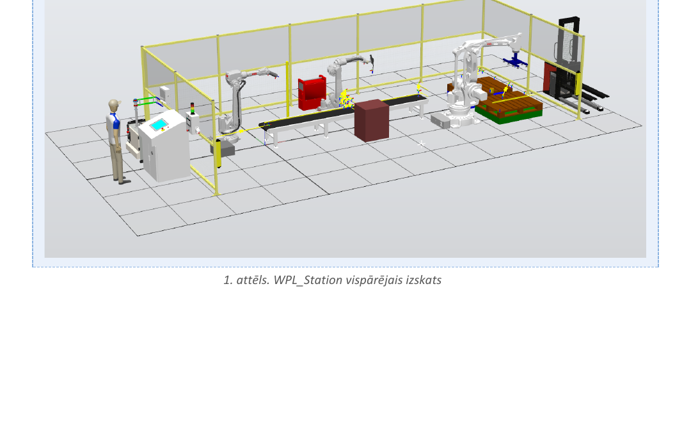
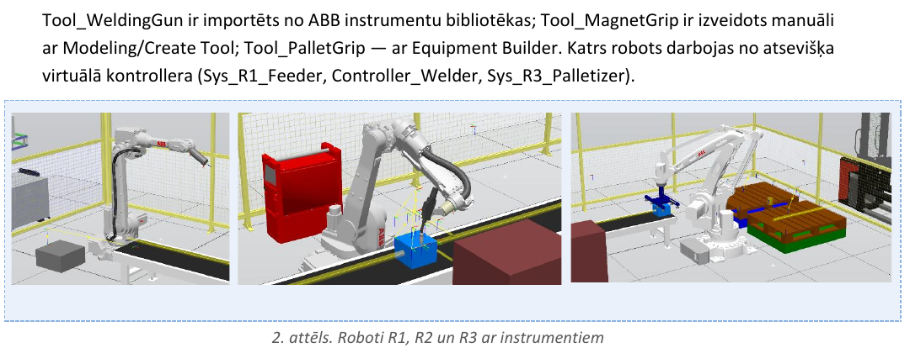
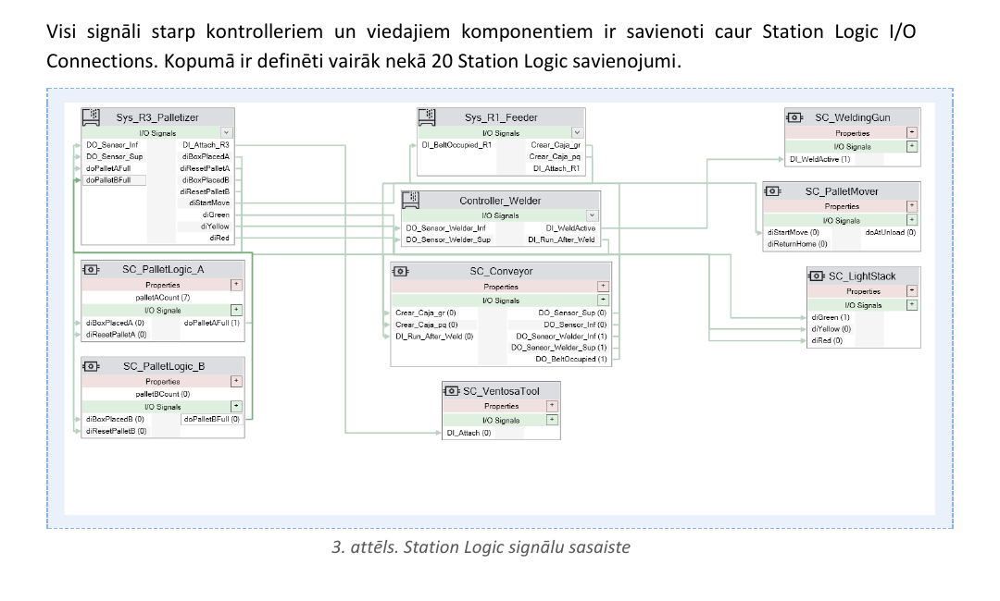
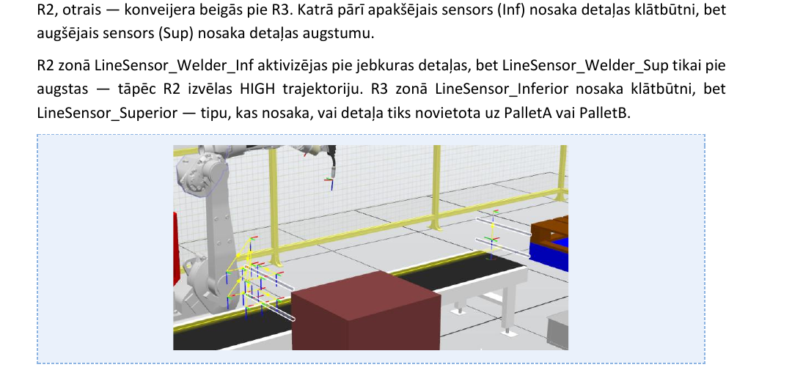

[← back to portfolio](../README.md)

# 🤖 Project 01

---

# 01 — WPL_Station: Three-Robot Welding & Palletizing Line

> Trīs robotu metināšanas un paletizēšanas līnija ABB RobotStudio vidē
> Three-cooperating-robot automated production cell simulated in ABB RobotStudio 2023

**Context** RTU studiju projekts (course project) · RMCE01 · 3rd year · 2026
**Supervisor** Artjoms Supoņenkovs
**Tools** ABB RobotStudio 2023 · RAPID · Smart Components · Station Logic

---

## Overview

WPL_Station is a fully automated production cell designed and simulated in ABB RobotStudio that models a realistic scenario in which three ABB robots cooperate to feed, weld and sort parts onto pallets. The cell handles **two part types** (tall yellow PART_Tall and short blue PART_Short, distinguished by height sensors) and runs a full demo cycle of **12 parts** — 4 onto pallet A and 8 onto pallet B — autonomously.

The project demonstrates:
- Multi-robot orchestration across three independent virtual controllers
- Smart Components for sensor and actuator logic outside RAPID
- Adaptive trajectory selection driven by sensor input (HIGH/LOW welding paths chosen by detected part height)
- Mass-production cycle synchronization with full HMI, alarms and safety stops

*Fig. 1 — Overall WPL_Station layout in ABB RobotStudio 2023: three ABB robots, conveyor, parts magazine, two pallet zones, light stack and safety fence*

---

## The three robots and their roles

| Robot | Model | Tool | Function |
|---|---|---|---|
| R1_Feeder | IRB 2600 12/1.85 | Tool_MagnetGrip (custom) | Feed cycle simulation and part-generation signaling |
| R2_Welder | IRB 1660ID 4/1.55 | Tool_WeldingGun (Binzel WH455D) | Welding with HIGH/LOW trajectory selection by height |
| R3_Palletizer | IRB 460 110/2.4 | Tool_PalletGrip (Equipment Builder) | Sorting and placement to pallet A or pallet B |

Each robot runs on its own virtual controller (`Sys_R1_Feeder`, `Controller_Welder`, `Sys_R3_Palletizer`).

---

## Station Logic — how the three controllers talk

*Fig. 2 — Station Logic signal wiring: 8 Smart Components connected via 20+ I/O signals between 3 virtual controllers*

The cell uses **25+ discrete I/O signals** wired through Station Logic across 8 Smart Components:

- **SC_Conveyor** — the most complex one. Generates parts (Source_Tall / Source_Short), moves them with LinearMover @ 200 mm/s, detects them with LineSensor_BeltLength, and provides Inf/Sup sensor pairs at the weld zone and at the conveyor end
- **SC_MagnetGrip** — magnet gripper logic for R1 (visual imitation)
- **SC_VentosaTool** — vacuum gripper logic for R3 (Attacher, Detacher, TipSensor, LogicGate_NOT)
- **SC_WeldingGun** — Highlighter-based weld-visualization effect triggered by DI_WeldActive
- **SC_PalletLogic_A / SC_PalletLogic_B** — Counter + Comparer pallet counters that raise doPalletAFull / doPalletBFull at 4 / 8 parts respectively
- **SC_PalletMover** — auxiliary pallet B mover (kept as optional functionality)
- **SC_LightStack** — Highlighter-based signal-tower control (green, yellow, red)

---

## Inf/Sup sensor pairs — the trick that drives adaptive logic

Two sensor pairs are placed along the conveyor — one at the weld zone (R2) and one at the conveyor end (R3). In each pair:

- **Inferior (Inf)** sensor sits low and triggers on ANY part (presence detection)
- **Superior (Sup)** sensor sits higher and triggers ONLY on tall parts (height detection)

When a part arrives at R2:
- `LineSensor_We