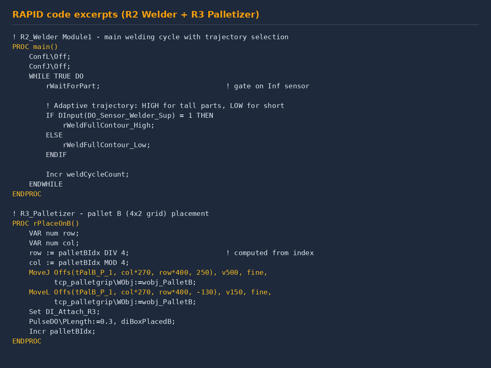
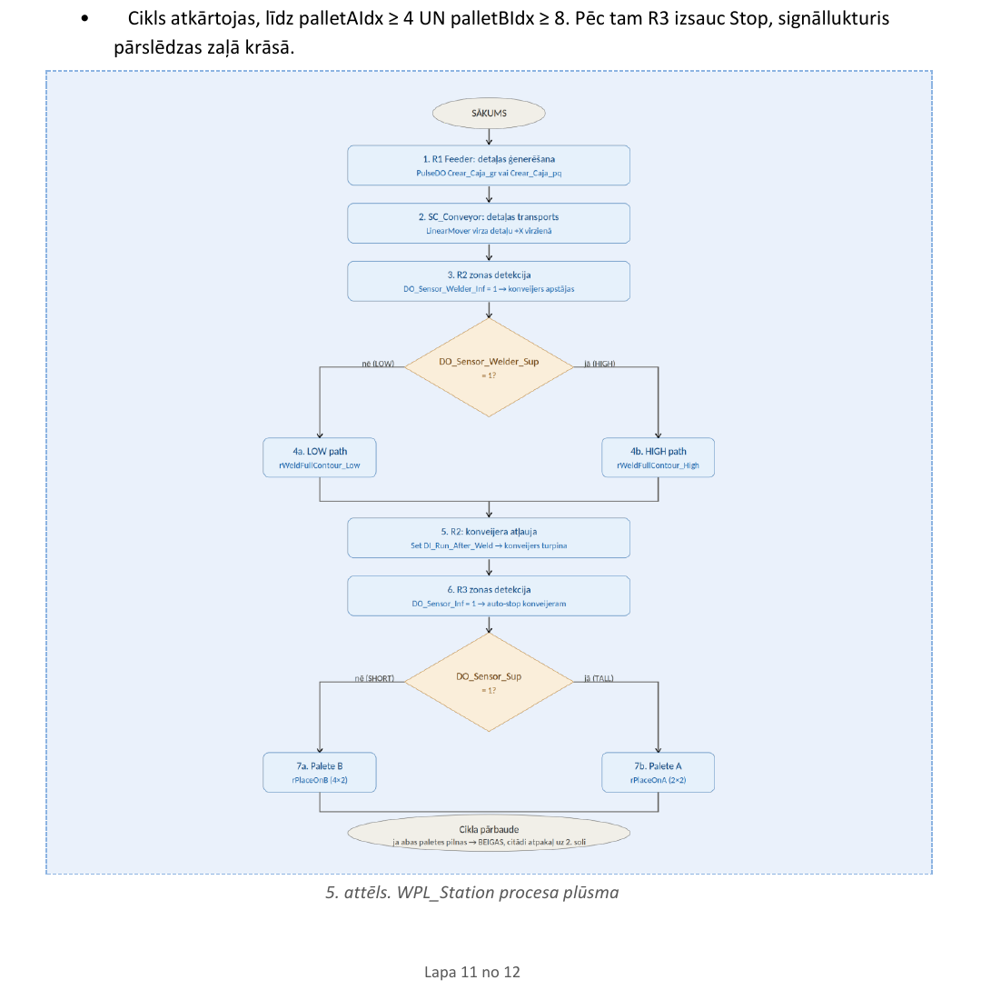

<div align="center">

[← back to portfolio](../README.md)

# 🤖 Project 01

[](#)
[](#)
[](#)

</div>

---

# 01 — WPL_Station: Three-Robot Welding & Palletizing Line

> Trīs robotu metināšanas un paletizēšanas līnija ABB RobotStudio vidē
> Three-cooperating-robot automated production cell simulated in ABB RobotStudio 2023

**Context** RTU studiju projekts · RMCE01 · 3rd year · 2026
**Supervisor** Artjoms Supoņenkovs
**Tools** ABB RobotStudio 2023 · RAPID · Smart Components · Station Logic

---

## Overview

WPL_Station is a fully automated production cell where three ABB robots cooperate to feed, weld and sort parts onto pallets. Handles two part types (tall PART_Tall and short PART_Short, distinguished by height sensors) and runs a full demo cycle of **12 parts** — 4 onto pallet A and 8 onto pallet B — autonomously.

The project demonstrates multi-robot orchestration across three independent virtual controllers, Smart Components for sensor/actuator logic outside RAPID, adaptive trajectory selection by sensor input (HIGH/LOW welding paths) and mass-production cycle synchronization with full HMI and safety stops.


*Fig. 1 — WPL_Station layout in ABB RobotStudio 2023*

---

## The three robots


| Robot | Model | Tool | Function |
|---|---|---|---|
| R1_Feeder | IRB 2600 12/1.85 | Tool_MagnetGrip (custom) | Feed cycle simulation |
| R2_Welder | IRB 1660ID 4/1.55 | Tool_WeldingGun (Binzel WH455D) | Welding with HIGH/LOW trajectory selection |
| R3_Palletizer | IRB 460 110/2.4 | Tool_PalletGrip (Equipment Builder) | Sorting to pallet A or B |

Each robot runs on its own virtual controller: `Sys_R1_Feeder`, `Controller_Welder`, `Sys_R3_Palletizer`.

---

## Station Logic — 8 Smart Components


*Fig. 2 — Station Logic signal wiring: 8 Smart Components connected via 20+ I/O signals*

- **SC_Conveyor** — Source_Tall / Source_Short generators, LinearMover @ 200 mm/s, LineSensor_BeltLength, Inf/Sup sensor pairs at weld zone and conveyor end
- **SC_MagnetGrip** — magnet gripper logic for R1
- **SC_VentosaTool** — vacuum gripper logic for R3 (Attacher, Detacher, TipSensor, LogicGate_NOT)
- **SC_WeldingGun** — Highlighter weld-visualization effect
- **SC_PalletLogic_A / SC_PalletLogic_B** — Counter + Comparer pallet counters (4 / 8 trigger thresholds)
- **SC_PalletMover** — auxiliary pallet B mover
- **SC_LightStack** — Highlighter signal-tower (green/yellow/red)

---

## Inf/Sup sensor pairs — the adaptive-logic trick


Two sensor pairs along the conveyor (weld zone and conveyor end). In each pair:
- **Inferior (Inf)** triggers on ANY part (presence)
- **Superior (Sup)** triggers ONLY on tall parts (height)

At R2: `LineSensor_Welder_Inf` activates → conveyor stops; `LineSensor_Welder_Sup` decides HIGH (tall, +150 mm Z) vs LOW trajectory. Same pattern at R3 picks pallet A or B.

---

## RAPID — 5 modules, 20+ procedures



R2_Welder main loop:

```rapid
WHILE TRUE DO
    rWaitForPart;
    IF DInput(DO_Sensor_Welder_Sup) = 1 THEN
        rWeldFullContour_High;
    ELSE
        rWeldFullContour_Low;
    ENDIF
    Incr weldCycleCount;
ENDWHILE
```

R3 pallet B (4×2 grid via DIV/MOD):

```rapid
PROC rPlaceOnB()
    VAR num row;
    VAR num col;
    row := palletBIdx DIV 4;
    col := palletBIdx MOD 4;
    MoveJ Offs(tPalB_P_1, col*270, row*400, 250), v500, fine,
          tcp_palletgrip\WObj:=wobj_PalletB;
    MoveL Offs(tPalB_P_1, col*270, row*400, -130), v150, fine,
          tcp_palletgrip\WObj:=wobj_PalletB;
    Set DI_Attach_R3;
    PulseDO\PLength:=0.3, diBoxPlacedB;
    Incr palletBIdx;
ENDPROC
```

R2_HelperMod has a separate module with operator menu (`TPReadFK`), diagnostics, emergency-stop. Motion types: **MoveJ**, **MoveL**, **MoveC** (circular weld seams).

---

## Full cycle — 12 parts in, 0 errors out



*Fig. 3 — Full cycle: feed → conveyor → R2 weld (HIGH/LOW path) → R3 sort (pallet A 2×2 / pallet B 4×2). Cycle ends when palletAIdx ≥ 4 AND palletBIdx ≥ 8; R3 stops, light tower goes green.*

---

## Files in this folder

| File | Size | What | How to view |
|---|---:|---|---|
| `WPL_Station_Tehniskais_Apraksts.pdf` | 933 KB | 12-page technical description (LV) | PDF viewer |
| `WPL_Station.rspag` | 66 MB | Packed RobotStudio station — full simulation | **ABB RobotStudio 2023+** via *File → Open → Unpack & Work Wizard* |
| `Cycle_demo.mp4` | 26 MB | Full demo cycle video (~3 min) | Any video player |
| `wpl_flow_diagram.png` | 208 KB | Process flow diagram | Image viewer |
| `images/` | — | Figures used in this README | — |

---

## How to open the simulation

1. Install **ABB RobotStudio 2023+** (free Basic license; new.abb.com)
2. **File → Open** → `WPL_Station.rspag` → Unpack & Work Wizard → defaults → Finish
3. Wait ~30 sec for all three virtual controllers to start
4. **Simulation tab → Play** to run the cycle
5. Inspect code via **Controller browser → controller → RAPID → modules**

---

## Skills demonstrated

- **ABB RAPID programming** — Move* instructions, work-object math (Offs, DIV/MOD), WaitDI sync, FlexPendant HMI
- **Smart Components** — Source, LinearMover, LineSensor, Highlighter, Attacher/Detacher, Counter/Comparer via Property Binding
- **Multi-controller signal sync** — Station Logic with 25+ I/O signals across 3 virtual controllers
- **Industrial robot path planning** — MoveJ/MoveL/MoveC use cases
- **Sensor-driven adaptive logic** — Inf/Sup detection for both branch selection and routing
- **Safety integration** — emergency-stop routine, light-tower status

---

## Latvian summary (LV)

Trīs robotu metināšanas un paletizēšanas līnijas pilna RobotStudio simulācija — IRB 2600 padevējs, IRB 1660ID metinātājs, IRB 460 paletizētājs sadarbojas, lai apstrādātu 12 detaļas (4 augstās → palete A 2×2, 8 zemās → palete B 4×2). Galvenais tehniskais izaicinājums — adaptīva metināšanas trajektoriju izvēle pēc augstuma sensora (HIGH/LOW) un palešu pildīšana ar DIV/MOD koordinātu aprēķinu.

Pilna tehniskā dokumentācija `WPL_Station_Tehniskais_Apraksts.pdf` failā. Simulācija — `WPL_Station.rspag` Pack & Go arhīvā, atveramā ar ABB RobotStudio 2023.
