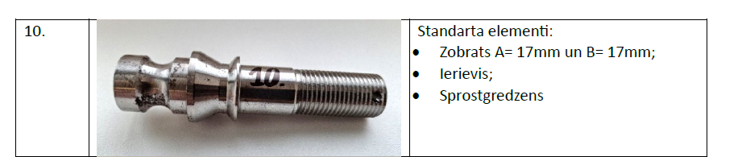
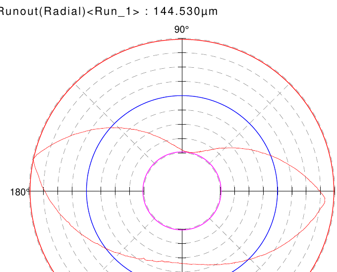
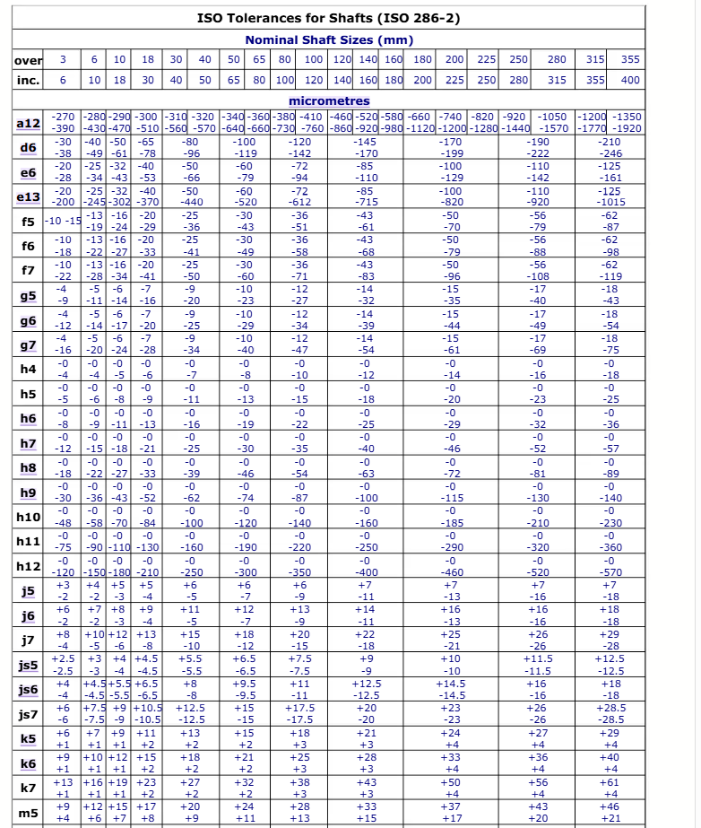
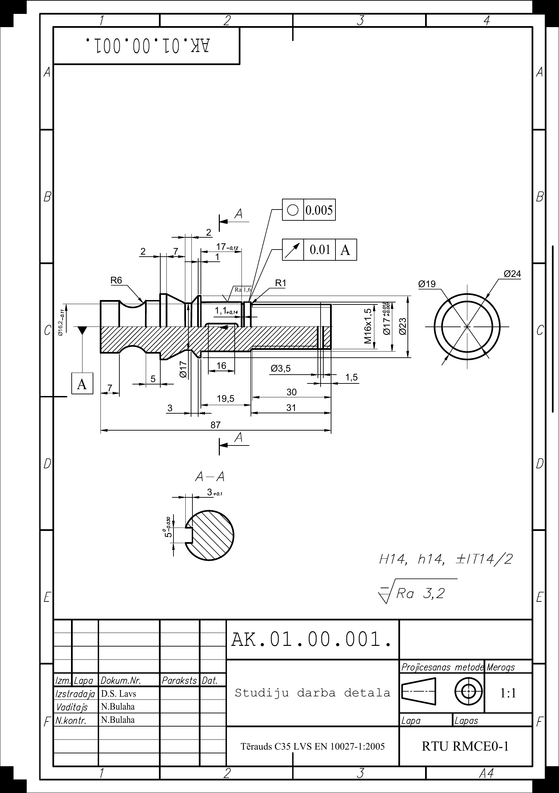

# 02 — Precision Metrology of an M16×1.5 Shaft

> Mērīšana, formas un novietojuma noviržu noteikšana un darba rasējuma izstrāde
> Precision measurement, GD&T characterization and ISO-compliant production drawing

**Context** RTU studiju projekts · course *Vispārīgā metroloģija, papildnodaļas* (General Metrology, advanced topics) · RMCE01 · 2026
**Group ID** 231RMC173
**Reviewers** N. Bulaha

---

## The task

The course brief required:
1. Choose appropriate instruments to capture every dimension of a real worn part (Detail #10)
2. Measure 3 critical seat diameters with **±0.001 mm precision** (10 readings each for statistical confidence)
3. Determine **surface roughness** on at least one critical face
4. Determine **form & position deviations** on at least two surfaces using a roundness tester
5. Produce an **ISO-compliant production drawing** of the *idealized* part — not the worn original — including:
   - Material designation per LVS EN 10027-1:2005
   - Surface roughness symbols (Ra)
   - Form & position tolerances (GD&T)
   - General tolerances fallback (H14/h14/±IT14/2)
6. Specify a manufacturing-grade fit for a standard mating element (gear + key + retaining ring) per the RTU catalog

---

## The part — Detail #10

*Fig. 1 — The actual measured shaft (Detail #10): camlock head, ring groove, M16×1.5 thread, Ø23/Ø19/Ø17 stages. Fitted with a gear (A=17 mm bore, B=17 mm width), Woodruff key and retaining ring per RTU catalog spec.*

The shaft has:
- **Camlock-style profile head** (Ø19) with ring groove for the camlock latch
- **Two conical transitions** between cylindrical stages
- **Cylindrical seat** Ø17 — the **critical** dimension (gear sits here)
- **Cylindrical support flange** Ø23
- **M16×1.5 metric thread** at the right end (24 mm long)
- **Ø3.5 mm transverse cross-hole** through the thread section

Total length: 87 mm.

---

## Instruments and measurement strategy

| Instrument | Used for | Precision | Notes |
|---|---|---|---|
| Digital micrometer (0–25 mm) | Critical Ø17, Ø19, Ø23 — **10 readings each** | ±0.001 mm | Statistical mean to reduce random error |
| Digital caliper (0–150 mm) | All linear / non-critical Ø | ±0.01 mm | Length stages, chamfers, hole position |
| **Mitutoyo Contracer CV-2100** | Thread profile capture | Z = (2.5 + \|0.1H\|) µm | Confirmed pitch p = 1.5 mm → M16×1.5-6g |
| **Mitutoyo Surftest SJ-210** | Surface roughness Ra | 0.001 µm resolution | Measured Ø17 seat: Ra ≈ 1.2 µm |
| **Mitutoyo Roundtest RA-120P** | Roundness + radial runout | 0.001 mm resolution | See "datum-correction lesson" below |

Lab conditions: T = 20 °C throughout.

---

## Critical measurements — 3 seat diameters

Each measured 10 times with the digital micrometer:

| Stage | Mean value (mm) | Function |
|---|---|---|
| Ø17 (gear seat) | 17.005 | Directly mates with gear — H7/k6 fit will be assigned in drawing |
| Ø19 (camlock head) | 18.992 | Mates with retaining mechanism |
| Ø23 (support flange) | 23.012 | Axial gear support; reference surface (datum A) |

The Ø17 readings ranged from 17.000 to 17.009 mm — a spread of 9 µm — illustrating why 10 readings rather than 1 matter at this precision level.

---

## The datum-correction lesson

*Fig. 2 — Roundness measurement of Ø17 seat (Mitutoyo Roundtest RA-120P): polar diagram — 122.6 µm out-of-round*

The first radial-runout reading came out as **454 µm** — implausibly large. The cause: I had placed the **datum** on a section with significant form deviation itself, so the "runout" measured everything against a wobbly reference.

The correction: re-set the datum to the support flange + camlock head (form deviation 4.1 / 9.9 µm respectively — clean cylindrical references). Runout recomputed to **144.5 µm** — the real value.

*Fig. 3 — Radial runout diagram after datum correction: 144.5 µm — the real value of the worn part*

**Takeaway for the drawing:** the worn part's actual numbers (○ 0.123 / ↗ 0.144 │ A) tell us about *this* aging shaft. The new-production drawing will specify tolerances appropriate for the *function* (gear fit), not these measured values.

---

## The production drawing — idealizing for manufacture

*Fig. 4 — Production drawing (scale 1:1, steel C35 LVS EN 10027-1:2005): all stages dimensioned, H7/k6 gear seat with es = +0.012 / ei = +0.001, DIN 6885 key groove (5×5×16, t1 = 3.0 mm), DIN 471 retaining-ring groove (d2 = 16.2, m = 1.1, s = 1.0), Ra 1.6 on critical surfaces / 3.2 elsewhere, ○ 0.005 / ↗ 0.01 │ A form tolerances per standard for the H7/k6 fit class*

Key drawing-engineering decisions:

- **Fit class:** H7/k6 transition fit on the Ø17 gear seat (per ISO 286-2) — es = +0.012, ei = +0.001. This allows light press / spin-fit assembly without an arbor press but eliminates rotation under load.
- **Form tolerances assigned per standard** — IT6/2 ≈ 0.005 for roundness, IT6 ≈ 0.010 for runout to datum A. These match what's *required* for H7/k6 to work, regardless of the worn part's much larger actual deviations.
- **Seat length 19.5 mm** — re-engineered from the original 17 mm by trimming 2 mm off the thread length (28 mm instead of 30) to make room for the retaining-ring groove behind the gear.
- **Surface roughness:** Ra 1.6 on the H7/k6 mating seat (Ø17) and on the support flange (Ø23) — both are functional surfaces. Ra 3.2 elsewhere as the general specification.
- **Standard elements specified:** gear (Ø17 H7/k6 seat, B=17 mm); key DIN 6885 / ISO 773 (b×h = 5×5, t1 = 3.0, L = 16); retaining ring DIN 471 (d2 = 16.2, m = 1.1, s = 1.0); thread ISO 965 (M16×1.5-6g).
- **General tolerance fallback:** H14 / h14 / ±IT14/2 for everything not explicitly toleranced.

The drawing also includes manufacturing notes: blunt sharp edges, center holes per DIN 332, thread runout groove for tool exit.

---

## Files in this folder

| File | Size | What's inside | How to view |
|---|---:|---|---|
| `Detalas_rasejums.pdf` | 230 KB | The production drawing as PDF — A4, scale 1:1, full GD&T annotations | Any PDF viewer |
| `Studiju_darbs_detala.docx` | 1.6 MB | Full study work report (LV): 10-page technical document with task brief, instruments table, measurement raw data (all 30 readings), polar diagrams, datum-correction analysis, fit selection justification, standard-element specification | Microsoft Word, LibreOffice, Google Docs |
| `images/` | — | Extracted figures used in this README | — |

---

## How to view the report

The `.docx` opens cleanly in any modern word processor. It contains:

- §1 Task definition with the RTU catalog mapping of which standard elements (gear, key, retaining ring) attach to Detail #10
- §2 Tabular instruments list with precision specs
- §3 Sketch with numbered measurement points (1–21)
- §4 Three measurement tables (10 readings × 3 critical Ø with computed means)
- §5 Contracer thread-profile capture
- §6 Roundness + runout measurements with both readings (wrong-datum 454 µm and corrected 144.5 µm) — the analytical lesson
- §7 Drawing justification: why the standard tolerances rather than the worn-part actuals
- §8 Standard-element fit calculations (H7/k6 ISO 286-2)

The drawing PDF can be printed at 1:1 on A4 for physical reference, or used as the source for re-issuing in CAD.

---

## Skills demonstrated

- **Precision metrology** — Mitutoyo CV-2100 contour tracer, Surftest SJ-210 roughness tester, Roundtest RA-120P form tester, digital micrometer and caliper
- **GD&T (form & position tolerances)** — roundness, runout, datum selection
- **Statistical measurement** — 10-reading sampling for sub-micron repeatability
- **ISO/DIN standard selection** — ISO 286-2 fit classes, DIN 6885 keys, DIN 471 retaining rings, ISO 965 metric threads
- **Tolerance-fit selection** — choosing H7/k6 transition fit, computing what form tolerances follow
- **Technical drawing per ISO conventions** — title block, view selection, section views, dimension chains, general-tolerance fallback
- **Root-cause analysis of measurement error** — datum mis-reference catch (454 → 144.5 µm)

---

## Latvian summary (LV)

Šis ir pilns vārpstas Detaļa Nr. 10 metroloģiskās raksturošanas un darba rasējuma izstrādes studiju darbs. Mērīšanai izmantoti pieci mērinstrumenti — digitālais mikrometrs un bīdmērs, Mitutoyo Contracer CV-2100 vītnes profilam, Surftest SJ-210 virsmas raupjumam (Ra ≈ 1,2 µm) un Roundtest RA-120P formas/novietojuma novirzēm.

Trīs galvenās sēžas diametrs (Ø17, Ø19, Ø23) izmērīts ar mikrometru ±0,001 mm precizitāti, katrs 10 reizes. Atklāts būtisks praktisks moments: pirmā radiālās sišanas mērījuma rezultāts 454 µm bija nereāls, jo bāze tika izvēlēta uz posma ar lielu formas novirzi — pēc korektas bāzes izvēles iegūta 144,5 µm.

Darba rasējumā detaļai piešķirtas H7/k6 salāgojuma tolerances (Ø17 k6 +0,012/+0,001 ISO 286-2), formas novirzes pēc standarta (○ 0,005 / ↗ 0,01 │ A), virsmas raupjums Ra 1,6 / 3,2, standarta elementi pēc DIN 6885 (ierievis) un DIN 471 (sprostgredzens).
