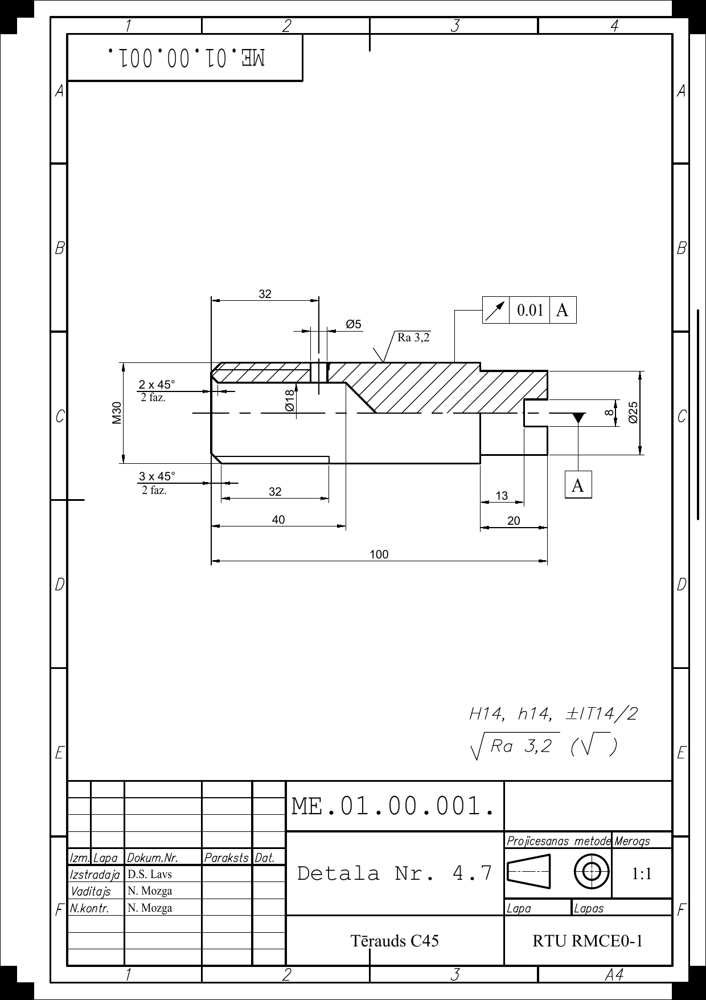
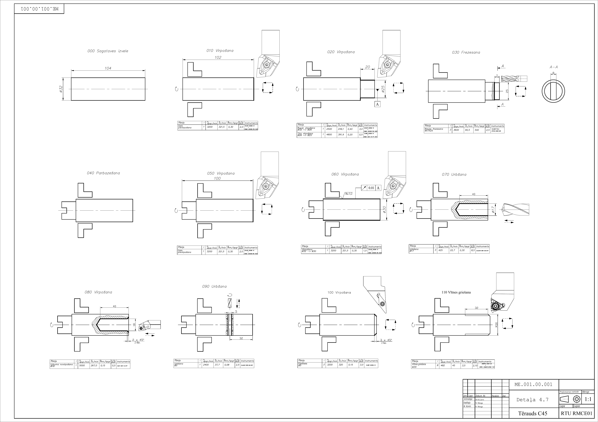
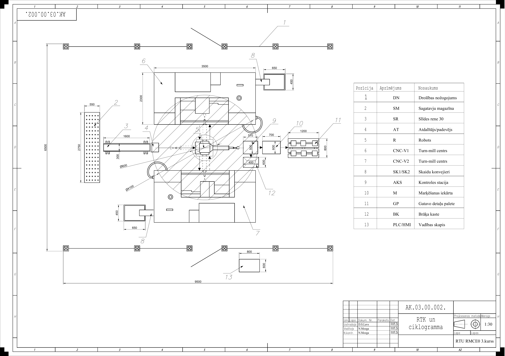

[← back to portfolio](../README.md)

# 🏭 Project 03

---

# 03 — RTK 4.7: Robotic Manufacturing Cell Design

> Robotizēta tehnoloģiskā kompleksa izstrāde detaļas Nr. 4 automātiskai apstrādei
> End-to-end design of a robotic machining cell for mass production (180 000 pcs/year)

**Context** RTU course work · *MAB373 — Detaļu orientēšanas un padeves iekārtas* (Part Orientation & Feeding Devices) · RMCE01 · 3rd year · 2026
**Variant** 4.7 (Detail Nr. 4, steel C45)
**Production volume** N = 180 000 pcs/year (mass production)

---

## The brief

Design a complete robotic technological cell (RTK = *Robotizētais Tehnoloģiskais Komplekss*) to manufacture a specified shaft component automatically. The design must cover:

- The full **technological route** from blank stock to finished part
- **Robot + CNC layout** with reach circles and safety zones
- **Workpiece feeding & orientation device** sized to keep the cell fed
- **Cutting regimes** computed per tool/operation
- **Cycle and takt-time** calculation
- **Cyclogram** synchronizing robot, both CNCs, magazine, separator and aux stations
- **Safety, sensors and chip removal** integration
- Comparison of design variants and selection

The work is documented across 16 sections + 4 graphical sheets (A2, A3 formats).

---

## The part — stepped shaft, steel C45

A stepped rotational-symmetry shaft with the following features:
- **Total length** L = 100 mm
- **Stage lengths** L1 = 40, L2 = 32, L3 = 32, L4 = 20, L5 = 13 mm
- **External diameter** Ø25 (cylindrical base/seat)
- **External thread** M30
- **Internal axial bore** Ø18 (left side, 0.6·M30)
- **Axial bore right** Ø8 × 13 mm
- **Cross-bore** Ø5
- **Chamfers** 2×45° and 3×45°
- **Surface roughness** Ra 3.2
- **Tolerance** 0.01 mm to datum A
- **Material** Steel C45 — carbide tooling required, with coolant supply

The geometry is well-suited to a **CNC turn-mill centre** (turning + cross-bore via C-axis driven tool) — no separate milling station needed.

*Fig. 1 — Detail Nr. 4.7 part drawing: Ø25 / M30 stepped shaft, steel C45, Ra 3.2, runout 0.01 │ A, total length 100 mm*

---

## Technological route — turn-mill machining sequence

The part is machined on a **CNC turn-mill centre** in two setups:

*Fig. 2 — Operation sketches: each multi-pass turning + chamfering + thread cutting operation*

Operations:
1. **Setup A** (gripping right end)
   - Face the left end + drill Ø18 axial bore
   - Rough-turn the Ø25 cylindrical stages
   - Finish-turn to Ra 3.2
   - Chamfer 2×45° (left transitions)
2. **Setup B** (gripping left, reversed)
   - Face the right end + drill Ø8 axial bore
   - Drive cross-bore Ø5 (C-axis + driven tool)
   - Cut M30 thread
   - Chamfer 3×45° (right transitions)

Two **identical turn-mill centres (CNC-V1, CNC-V2)** are used in parallel — one does Setup A while the other does Setup B on the previous part, giving a continuous flow.

---

## Cell layout — 6.5 × 9.5 m, 13 positions

*Fig. 3 — RTK cell floor plan (scale 1:30, A2 sheet): 13 numbered positions, 6.5 × 9.5 m footprint, robot Ø600 inner / Ø400 outer reach circles*

| # | Code | Element | Role |
|---|---|---|---|
| 1 | DN | Drošības nožogojums | Safety fence (perimeter) |
| 2 | SM | Sagatavju magazīna | Workpiece magazine |
| 3 | SR | Slīdes rene 30 | Feeding slide |
| 4 | AT | Atdalītājs / padevējs | Singulator/separator |
| 5 | R | Robots | Industrial robot |
| 6 | CNC-V1 | Turn-mill centre | First CNC |
| 7 | CNC-V2 | Turn-mill centre | Second CNC |
| 8 | SK1/SK2 | Skaidu konveijieri | Chip conveyors |
| 9 | AKS | Kontroles stacija | Inspection station |
| 10 | M | Marķēšanas iekārta | Marking machine |
| 11 | GP | Gatavo detaļu palete | Finished-parts pallet |
| 12 | BK | Brāķa kaste | Reject bin |
| 13 | PLC/HMI | Vadības skapis | Control cabinet |

The robot reach is laid out so its **outer reach circle (Ø600)** covers both CNCs, the inspection station and the magazine outlet — keeping cycle time short. Inner reach circle (Ø400) covers the pallet and reject zone.

---

## Cyclogram — keeping robot, CNCs and aux stations in sync

*Fig. 4 — Same layout with the cyclogram overlay: a time-synchronised chart showing what robot, CNC-V1, CNC-V2, magazine, separator, inspection and marking are doing across one full production cycle*

The cyclogram is the design's heart: it shows that:
- CNCs run continuously (one machining while the other is being loaded)
- The robot's cycle is dominated by *waiting* for the CNCs (machining time > robot transfer time) — confirming the cell is **CNC-bound**, not robot-bound
- The marking and inspection stations operate in parallel with CNC machining, off the critical path

Cycle time and takt are computed from the cyclogram for the target 180 000 pcs/year throughput.

---

## Engineering scope — 16 sections of the course work

The full course work (~7 300 words, in `RTK_kursa_darbs_FULL.docx`) covers:

1. Initial data & constructive/technological analysis of the part
2. Production-type determination (180 000 pcs/yr → mass production)
3. Workpiece (sagatave) selection — solid bar vs forging trade-off
4. Technological route — operation sequence + setup choice
5. Basing and clamping strategy with datum A as reference
6. RTK 