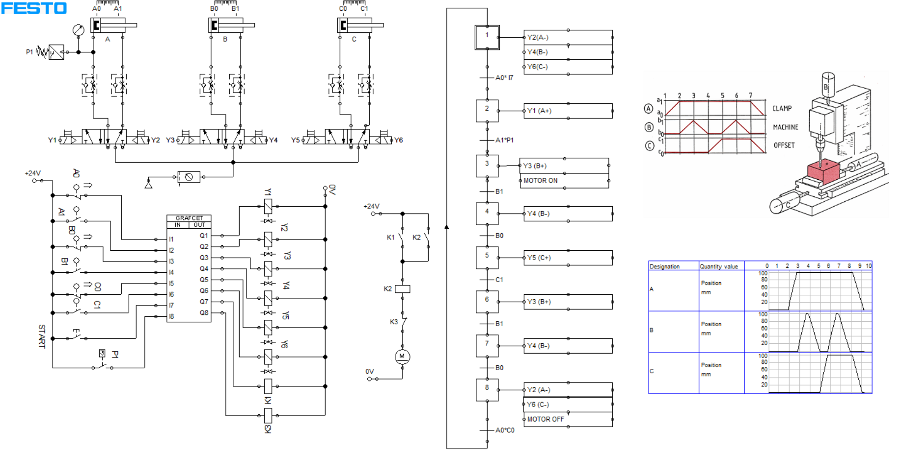
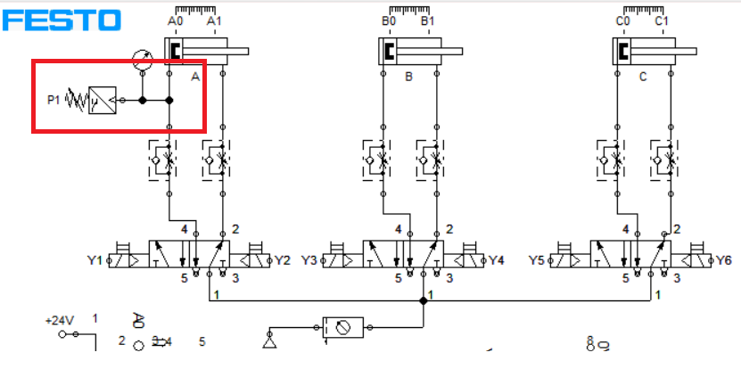
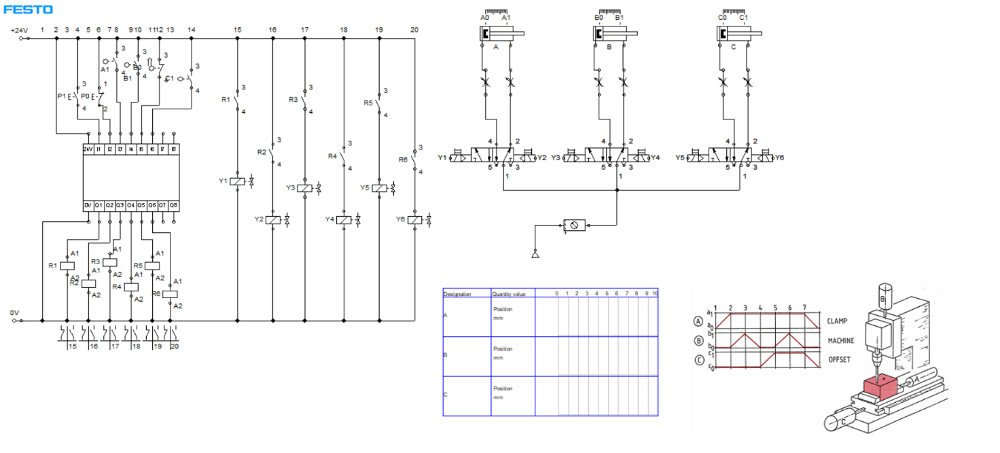
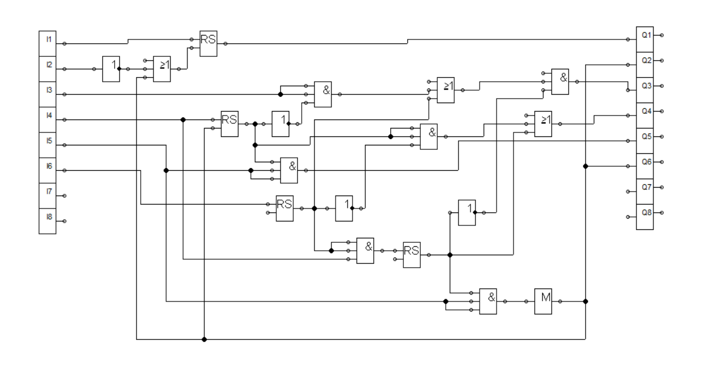
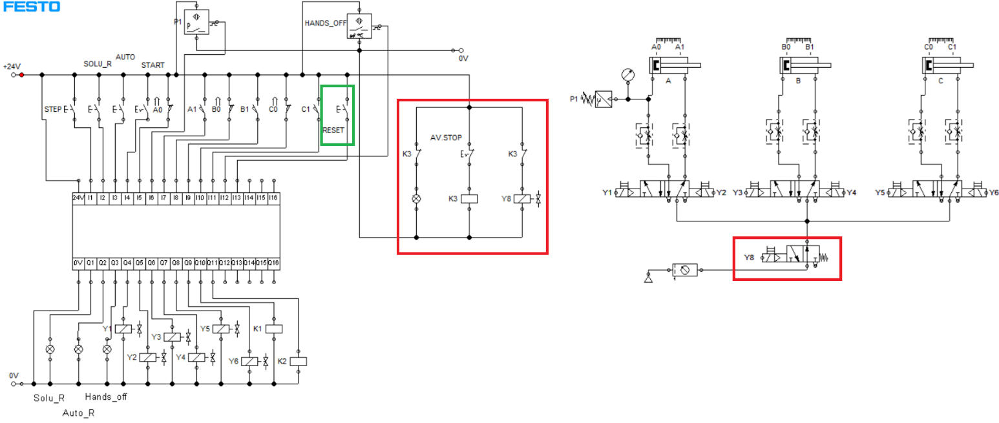
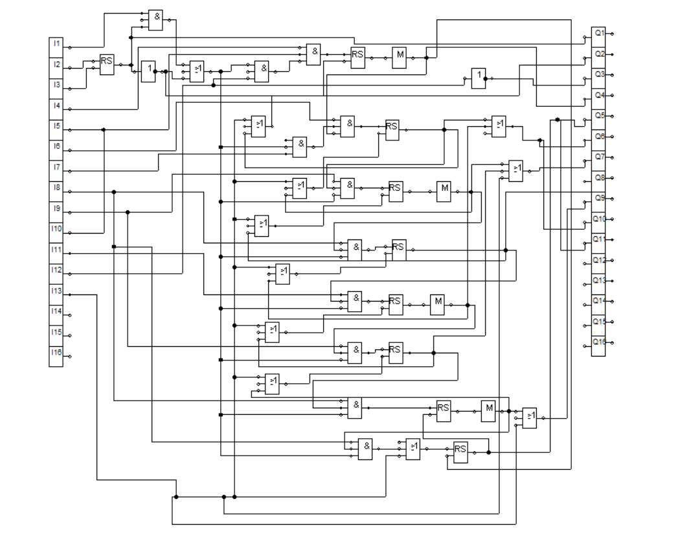

[← back to portfolio](../README.md)

# 🔌 Project 04

---

# 04 — Automated Two-Hole Drilling Machine

> Automatizēta iekārta divu urbumu izveidošanai sagatavē
> PLC control with GRAFCET sequence, FBD program and FluidSIM simulation

**Context** RTU · *Ražošanas Automatizācijas pamati* · 3. uzdevums · RMCE01 · 2nd year · 2024/2025
**Tools** FluidSIM (electropneumatic + GRAFCET simulation) · Siemens LOGO! SoftComfort (FBD)

---

## The brief

*"Drill two holes in a parallelepiped workpiece. Operator places workpiece in clamp. After START: cylinder A clamps; when force reaches max, drill motor starts and cylinder B advances/retracts (slow fwd / fast return). Cylinder C shuttles carriage to second position, second hole drilled same way. Then clamp release, carriage home, motor stop."*

Two deliverables:
- **Section A** — GRAFCET diagram in FluidSIM
- **Section B** — FBD implementation on Siemens LOGO!

Plus safety + operating modes.

---

## The actuators

| Element | Role | Direction | End sensors |
|---|---|---|---|
| **Cylinder A** | Clamping | Y1/Y2 | A0, A1, **P1** (max-force sensor) |
| **Cylinder B** | Drill feed | Y3/Y4 (slow/fast) | B0, B1 |
| **Cylinder C** | Carriage shuttle | Y5/Y6 | C0, C1 |
| **Motor M1** | Drill rotation | K1 / K3 (emergency) | — |

Safety valves: Y7 (general air), Y8 (emergency dump).

---

## Section A — GRAFCET in FluidSIM

*Fig. 1 — GRAFCET cycle built on cylinder end-states A0/A1, B0/B1, C0/C1 + P1 gate before B+*

Two engineering catches required iteration:
1. **P1 gating** — Brief says B+ waits until clamping at **max force**, not just A1. Solution: guard `A1 AND P1` on the transition from clamping to drilling.
2. **Motor sync** — Motor only during drilling. Solution: put K1 on the same step that initiates B+.

---

## Section B — FBD on Siemens LOGO!

Start from a classical electrical schematic — relay + 6 solenoid valves as conceptual backbone:

*Fig. 2 — Electrical relay schematic: Y1–Y6 solenoid valves, R-relays for sequencing*

Then FBD program in LOGO! SoftComfort:

*Fig. 3 — Final FluidSIM: pneumatic system + PLC FBD + cylinder-motion timing diagram + machine animation*

Set/reset flip-flops per cylinder, transition logic, "system ready" gate that prevents START unless safe.

---

## Safety + operating modes

### Emergency stop (AV.STOP)

*Fig. 4 — AV.STOP: relay K3 halts cycle + valve Y8 dumps pneumatic supply (zero pressure → no movement) + emergency indicator*

**RESET** button manually re-arms after emergency: clears outputs, deactivates relays, returns to home.

### Auto / Manual modes (SOLU_R)

*Fig. 5 — SOLU_R button activates manual STEP-by-STEP mode; AUTO returns to free-running cycle*

- **Auto**: full cycle continuous after START
- **Manual** (SOLU_R): pause at each transition, **STEP** to advance one stage

### Hands-off safety (HANDS_OFF)

*Fig. 6 — Optical light-curtain sensor blocks cycle start while operator's hand is in the work envelope. Sensor wired through START enable.*

---

## Files in this folder

| File | Size | What |
|---|---:|---|
| `MD_3.uzd_Razosanas_Automatizacijas_pamati.docx` | 4.4 MB | Full study work report LV — narrative + all 8 figures + conclusions |
| `fluidsim_sources/GRAFCET_FluidSIM.ct` | — | Original GRAFCET FluidSIM file (Section A) |
| `fluidsim_sources/Elektriska_shema.ct` | — | Electrical relay schematic backbone |
| `fluidsim_sources/Hard_FBD.ct` | — | Full PLC FBD program with safety + modes |
| `fluidsim_sources/Grafcet.ct` | — | Intermediate GRAFCET iteration |
| `fluidsim_sources/Automatizacija_final.ct` | — | Final integrated solution |
| `images/` | — | Figures used in this README |

---

## How to open

`.ct` files are **Festo FluidSIM** project files.

- **Software:** Festo FluidSIM (FluidSIM-P / -H / -E or unified FluidSIM 6+)
- **Open:** *File → Open* → select `.ct`
- **Run:** *Simulation → Start* (F9) — cylinders animate, sensors trigger, GRAFCET steps highlight, PLC outputs activate live
- **Inspect FBD:** double-click PLC block → block diagram view → step through inputs/outputs

If no FluidSIM available — the `.docx` contains all 8 figures as embedded screenshots.

---

## Skills demonstrated

- **PLC programming** (Siemens LOGO! FBD)
- **GRAFCET sequence design** — transition formulation, parallel/sequential structures
- **FluidSIM** electropneumatic + PLC co-simulation
- **Electrical relay schematic design** — set/reset, sequencing
- **Industrial safety**: E-stop with relay + pressure dump, operating-mode switching (Auto / Manual STEP), light-curtain interlock
- **Multi-mode operator interface** (AUTO / MANUAL STEP / RESET / AV STOP)

---

## Latvian summary (LV)

Automātiska divu urbumu urbšanas iekārta — pilna automatizācijas sistēma trim pneimocilindriem (A iespīlēšana, B urbja padeve, C kamanu pārvietošana) un urbja rotācijas elektromotoram. **A sadaļa** — GRAFCET FluidSIM vidē; **B sadaļa** — FBD programmēta vadība Siemens LOGO!

Galvenais GRAFCET izstrādes mācība: P1 spiediena sensors jāizmanto kā vārti starp iespīlēšanu un urbšanu (nevis tikai A1 gala stāvoklis) — nodrošina pareizu iespīlēšanas spēka kontroli pirms urbšanas.

Pievienoti drošības + operatora režīmi: **AV.STOP** (avārijas K3 + Y8 pneimatiskā pārtraukšana), **SOLU_R** (manuālais STEP režīms), **HANDS_OFF** (optiskais sensors). Pilna dokumentācija `MD_3.uzd_Razosanas_Automatizacijas_pamati.docx`. FluidSIM `.ct` faili — `fluidsim_sources/`.
