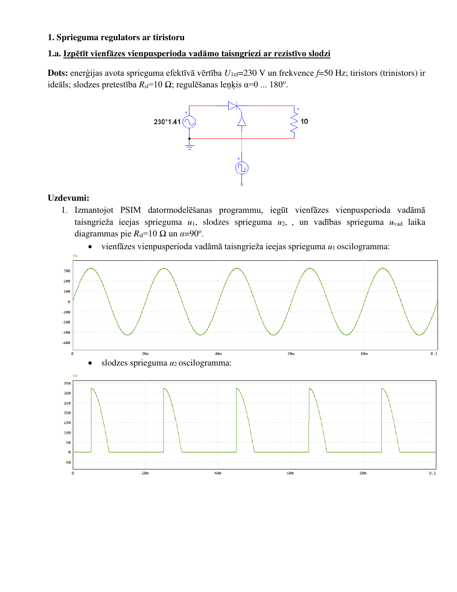
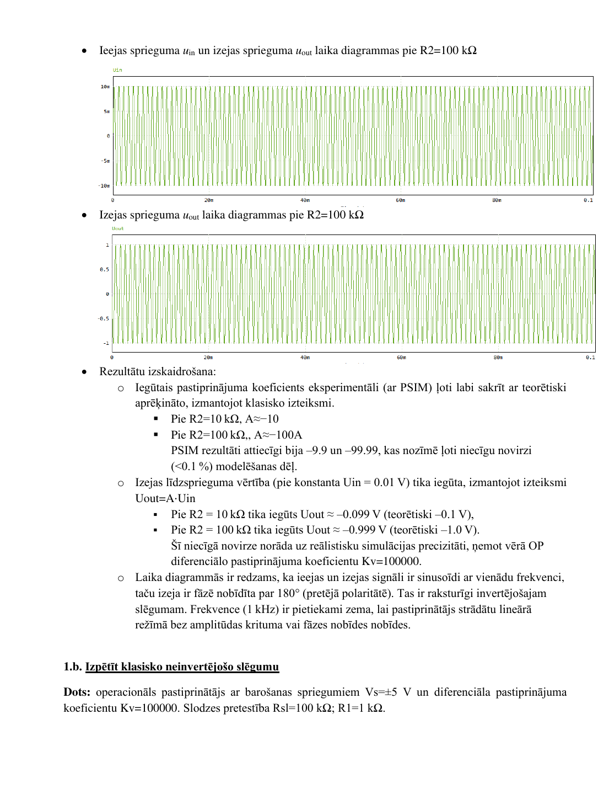
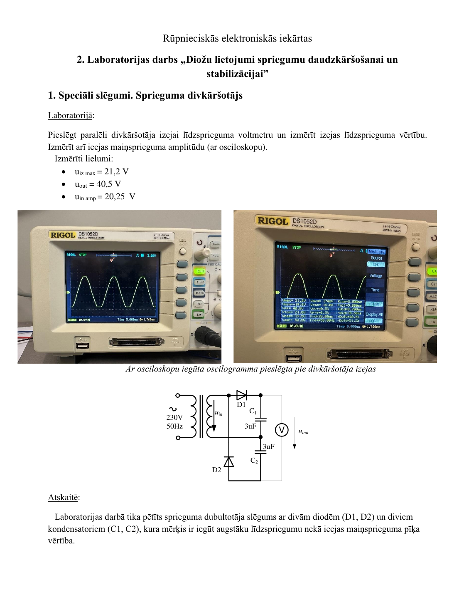
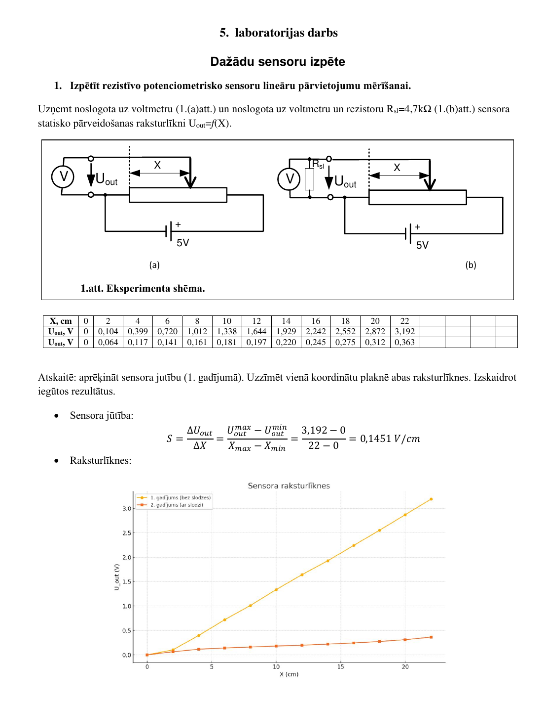

[← back to portfolio](../README.md)

# 💡 Project 05

---

# 05 — Industrial Electronics Coursework — 7 Lab & Practical Works

> Praktiskie un laboratorijas darbi kursā *Rūpnieciskās elektroniskās iekārtas*
> Lab and practical works covering analog & power electronics foundations

**Context** RTU · Enerģētikas un elektrotehnikas fakultāte · RMCE01 · 2nd year · 2024/2025
**Tools** PSIM (circuit simulation) + bench measurement (oscilloscope, multimeter)

---

## Why this matters for the portfolio

This coursework forms the **direct intellectual basis** for my current role as *Electronics Adjuster (Elektronikas regulētājs)* at Latvijas Finieris. Each lab combined three steps: analytical calculation → PSIM simulation → bench measurement. The cross-check between these is what makes the engineering value.

---

## The 7 works

### Topic 1 — Diode rectification (Lab #1 + Practical)
- **p-n diodes vs Schottky** in rectification
- Single-phase half-wave + full-wave bridge
- Ripple analysis with / without filter capacitor

### Topic 2 — Voltage multiplication & stabilization (Lab #2)
- **Voltage doubler**: u_in_amp = 20.25 V → u_out = 40.5 V (matches 2× peak)
- **Zener stabilizer** — load line, regulation factor

### Topic 3 — Thyristor voltage regulator (Practical)

*Fig. 1 — Thyristor-controlled rectifier (PSIM, α = 90°): u₁, u₂, u_vad waveforms*

Single-phase half-wave with R_sl = 10 Ω, α swept 0…180°.

### Topic 4 — Linear stabilizer (Lab #3)
U_in = 15 V → U_out = 10 V via potentiometer R2. Stabilization coefficient + output impedance.

### Topic 5 — Op-amps, ADC, DAC (Practical #3)

*Fig. 2 — Inverting op-amp (V_s = ±5 V, K_v = 100000): verified A = R2/R1 for R2 = 10 kΩ → A = -10 and R2 = 100 kΩ → A = -100*

Both DC + 1 kHz sinusoidal. ADC/DAC converter characterization.

### Topic 6 — Voltage doubler bench

*Fig. 3 — Bench: u_in_amp = 20.25 V → u_out_DC = 40.5 V on load*

### Topic 7 — Potentiometric sensors (Lab #5)

*Fig. 4 — Static transfer curve U_out = f(X): top unloaded, bottom loaded with R_sl = 4.7 kΩ — loading effect quantified*

Real-world ADC interfacing problem.

---

## Files in this folder

| File | Topic |
|---|---|
| `Lab1_Diozu_lietojumi_taisngriesanai.pdf` | Diode rectification (2.5 MB) |
| `Praktiskais_Diozu_taisngriesana.docx` | Diode practical (1.2 MB) |
| `Lab2_Diozu_daudzkarsosana_stabilizacija.pdf` | Voltage doubling + stabilization (812 KB) |
| `Lab3_Linearie_kompensacijas_stabilizatori.pdf` | Linear stabilizers (688 KB) |
| `Praktiskais_Spriegumu_regulatori.pdf` | Thyristor regulator (1.0 MB) |
| `Praktiskais3_Pastiprinataji_ADC_DAC.pdf` | Op-amps, ADC, DAC (453 KB) |
| `Lab5_Sensoru_izpete.pdf` | Sensors (1.9 MB) |
| `psim_sources/*.psimsch` | Editable PSIM circuit files |
| `images/` | Figures used in this README |

---

## How to view

### The PDFs
Standard PDF viewer. Each report: task → theory → PSIM simulation (oscillograms) → bench measurement → comparison → conclusions.

### PSIM source files
**Software:** PSIM 2025 (or PSIM 11+). Student licenses available.

**Open:** PSIM → *File → Open* → `.psimsch` → schematic loads with all components + probes pre-placed.

**Run:** *Simulate → Run Simulation* (F8) → results in SIMVIEW window.

**Modify:** change R, swap diode model, change thyristor α — re-run to see effect.

---

## Skills demonstrated

- **Analog electronics** — diode rectification, Zener regulation, voltage multipliers
- **Power electronics** — thyristor-controlled rectifiers, firing-angle control
- **Op-amp circuits** — inverting, gain calculation
- **ADC/DAC fundamentals**
- **Sensor characterization** — resistive potentiometric + loading effects
- **PSIM circuit simulation**
- **Bench measurement** — oscilloscope, voltmeter, signal generator
- **Three-way validation** — analytical / simulated / measured cross-check

---

## Latvian summary (LV)

Septiņu laboratorijas + praktisko darbu komplekts kursā *Rūpnieciskās elektroniskās iekārtas* (RTU EEF, 2024./2025.):
1. **Diožu lietojumi taisngriešanai** — p-n vs Šotki diodes, vienfāzes taisngrieži
2. **Diožu daudzkāršošana + stabilizācija** — divkāršotājs (20,25 V_amp → 40,5 V_DC), Zenera stabilizators
3. **Spriegumu regulatori** — vienfāzes vadāmais taisngriezis ar tiristoru
4. **Lineārie kompensācijas stabilizatori** — U_in 15 V → U_out 10 V
5. **Pastiprinātāji, ACP/CAP** — operacionālie pastiprinātāji, invertējošais slēgums
6. **Sensori** — rezistīvie potenciometriskie sensori

Visi darbi apvienoja analītiskos aprēķinus, PSIM modelēšanu un stenda mērījumus. Tieši šis kurss veido manas pašreizējās *Elektronikas regulētāja* darba vietas Latvijas Finierī intelektuālo bāzi.
