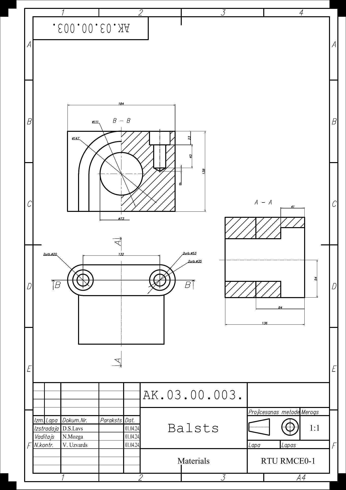
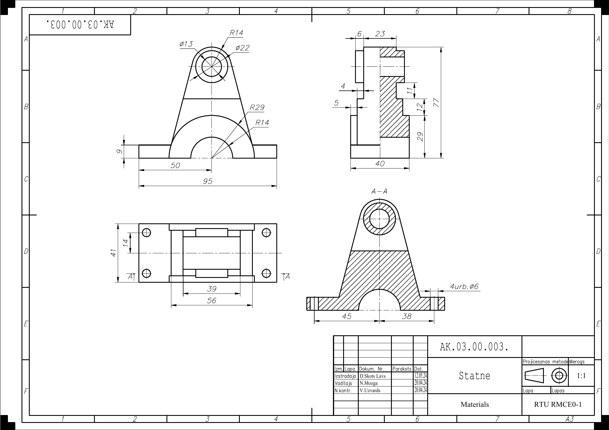
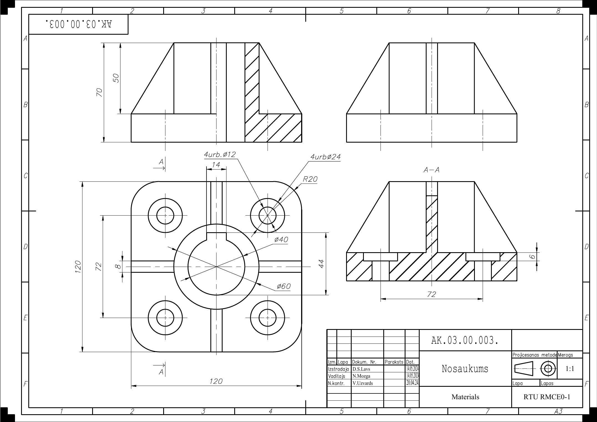
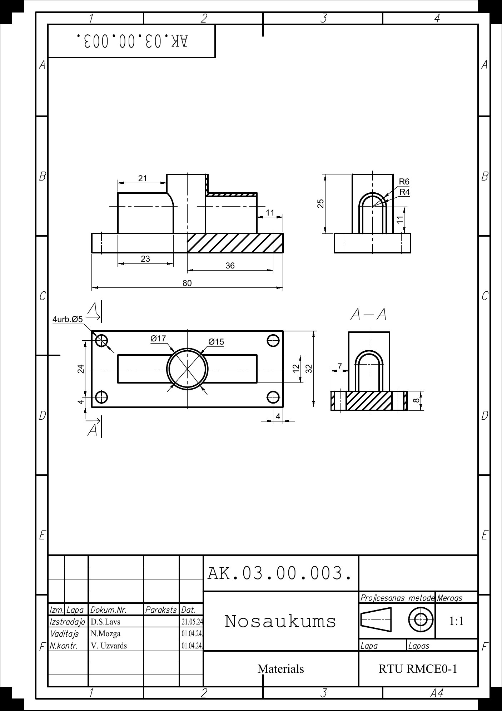

[← back to portfolio](../README.md)

# 📏 Project 06

---

# 06 — Engineering Drawing Coursework

> Inženiergrafikas studiju darbi — tehniskie rasējumi formātos A4 un A3
> Foundational technical-drawing coursework per ISO/LVS conventions

**Context** RTU studiju projekti · RMCE01 · 2nd year · 2024
**Supervisor** N. Mozga
**Tools** AutoCAD 2024

---

## Why this matters

Engineering drawings are the universal language of mechanical and mechatronic engineering. Before doing the metrology study (project 02) or RTK manufacturing cell (project 03), I worked through this foundational coursework to be fluent in:

- **Multi-view orthogonal projection** — first-angle ISO convention
- **Section views** — when to use, how to indicate cutting planes, hatch patterns
- **Dimensioning** — placement, chain vs base-line, datum reference
- **Title-block discipline** — proper population of LVS frame
- **Material specification** — LVS EN 10027-1:2005 naming
- **Sheet layout** — A4 portrait, A3 landscape, scale selection

Four drawings cover progressively complex parts.

---

## The four drawings

### 01 — Balsts (Support / Bracket)

*Fig. 1 — Balsts, A4 portrait, 1:1*

Bracket/mounting support. Fundamentals:
- Three orthogonal views
- Single section view
- Linear dimensioning chain
- Standard title block

### 02 — Statne (Frame / Stand)

*Fig. 2 — Statne, A3 landscape, 1:1*

More complex frame:
- A3 sheet management
- Multiple section views (full + partial)
- Hidden-line conventions
- Hole pattern dimensioning

### 03 — Detail Drawing (A3)

*Fig. 3 — Detail, A3 landscape, 1:1*

Third detail:
- Advanced section views (offset / aligned)
- Threaded hole notation
- Chamfer + fillet specification
- General tolerance fallback in title block

### 04 — Task 5 Detail (A4)

*Fig. 4 — Task 5 detail, A4 portrait, 1:1*

Final exercise — small/precise part. Practices everything previous + tighter dimension placement, surface roughness symbols, steel material spec.

---

## Files in this folder

| File | Sheet | What |
|---|---|---|
| `01_Balsts_A4.pdf` | A4 portrait, 1:1 | Bracket/support |
| `02_Statne_A3.pdf` | A3 landscape, 1:1 | Frame/stand |
| `03_Detala_A3.pdf` | A3 landscape, 1:1 | Detail |
| `04_Uzd5_Detala_A4.pdf` | A4 portrait, 1:1 | Task 5 detail |
| `images/` | — | Figures used in this README |

---

## How to view & print

PDFs are **production-ready** — print to A4 / A3 at 100% scale for 1:1 manufacturing reference. A4 on letter-size printer; A3 on A3-capable or split-print to two A4 with overlap.

Title blocks have all standard fields: drawing number, part name, material, scale, author (D.S. Lavs), supervisor signatures (N. Mozga + V. Uzvards), date, sheet count.

---

## Foundation for later work

Conventions practiced here apply directly to:
- **Project 02 (Metrology Shaft)** — same title block, dimensioning, Ra symbols, plus advanced GD&T
- **Project 03 (RTK 4.7)** — part drawing + operation sketches + layout drawing at A2

So this folder is the engineering-drawing foundation; projects 02 and 03 apply the technique to substantive work.

---

## Skills demonstrated

- **ISO / LVS technical drawing conventions**
- **Multi-view orthogonal projection** (first-angle)
- **Section views** — full, partial, offset, aligned
- **Dimensioning and tolerancing** — chain, baseline, general-tolerance fallback
- **Surface roughness symbols** (Ra)
- **Hidden-line and centerline conventions**
- **Title-block discipline**
- **A4 / A3 sheet layout management**
- **AutoCAD 2024 production workflow** — model space + layouts, viewports, PDF export

---

## Latvian summary (LV)

Inženiergrafikas pamatkursa darbu komplekts (RTU, RMCE01, 2024) — četri tehniskie rasējumi A4 un A3 formātos, kas praktizē ISO/LVS standartus:
- **Balsts** (A4, 1:1) — atbalsta detaļa
- **Statne** (A3, 1:1) — rāmis/karkasa elements
- **Detaļa** (A3, 1:1) — sarežģītāka komponente ar griezumiem
- **Detaļa 5. uzdevumam** (A4, 1:1) — noslēdzošais vingrinājums

Visi rasējumi seko LVS rakstrāmim, daudzskatu projicēšanai, griezumu un izmēru norādīšanai pēc standartiem. Šis darbu komplekts ir tehniskais pamats vēlākiem projektiem — Detaļas Nr. 10 metroloģijai (02) un RTK 4.7 kursa darbam (03).
