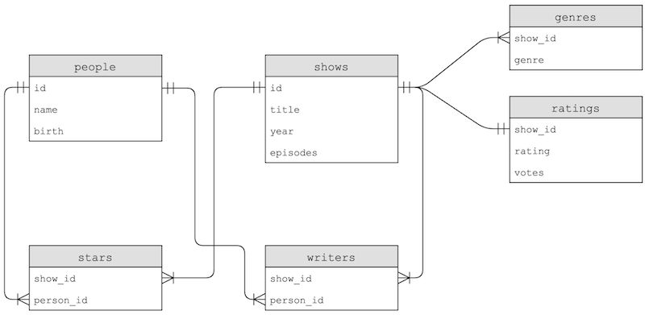
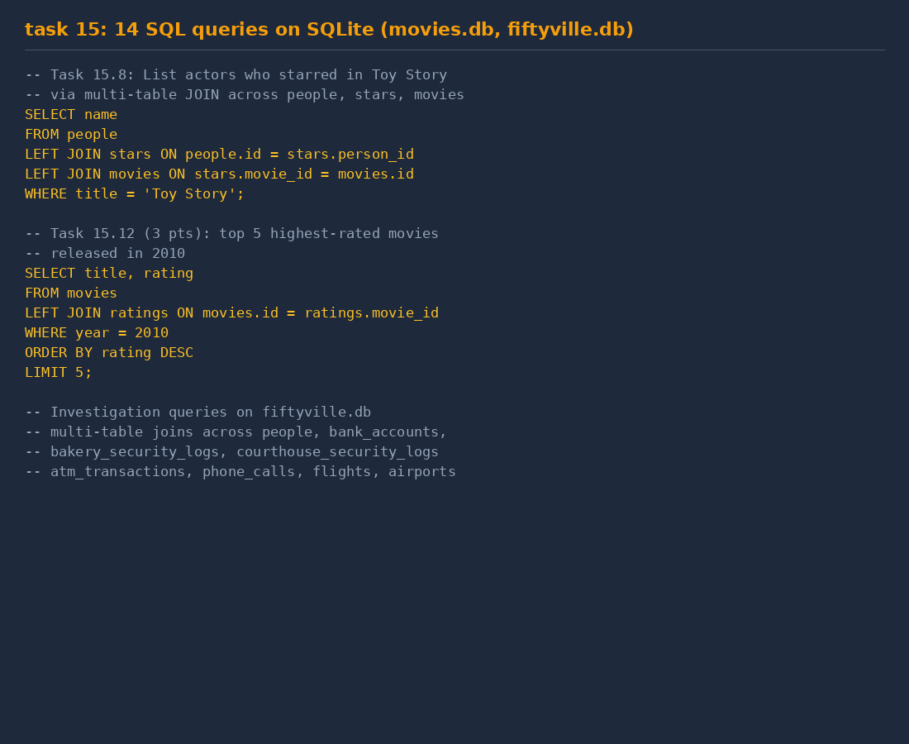
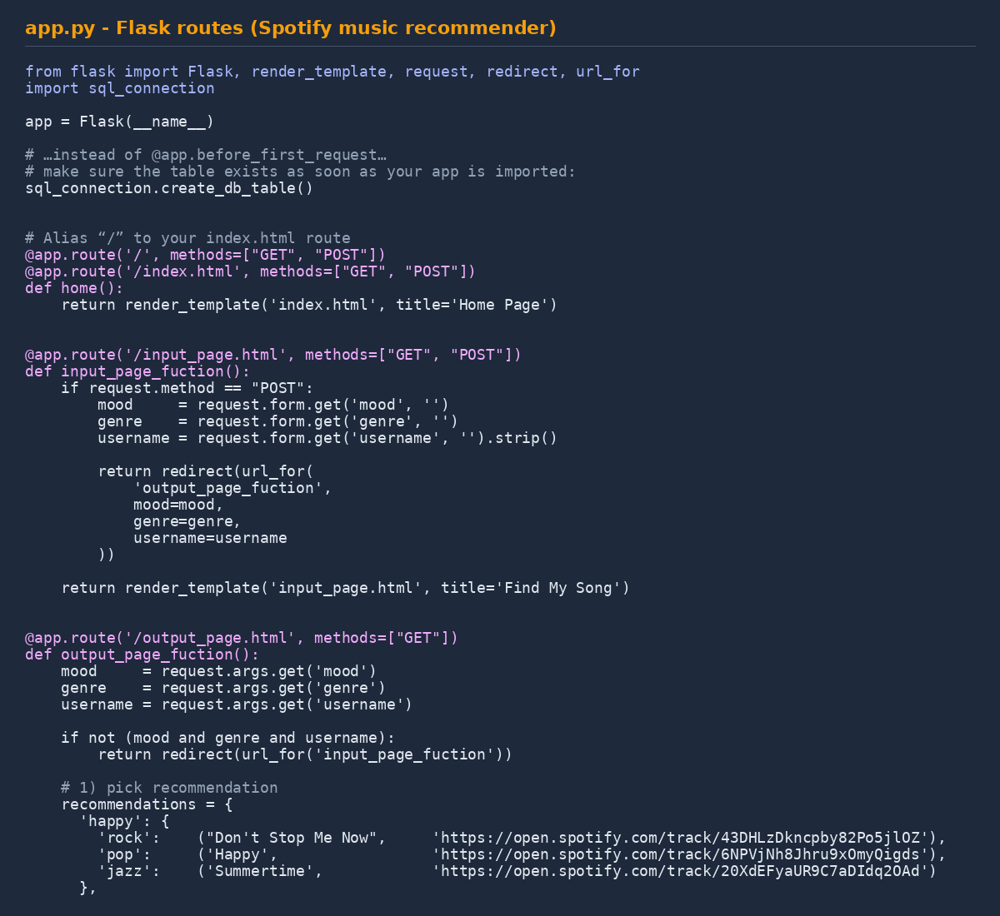

<div align="center">

[← back to portfolio](../README.md)

# 💻 Project 07

[](#)
[](#)
[](#)

</div>

---

# 07 — Programming Coursework: 16 Progressive Tasks

> 16 autograded assignments — Python → C/C++ → SQL → Flask web app
> A full programming foundation built over one academic year

**Context** RTU programming course (GitHub Classroom: `rtudip`) · RMCE01 · 2024/2025
**Languages** Python · C / C++ · SQL · HTML / CSS / JavaScript · Jinja
**Frameworks** Flask · Bootstrap · SQLite

---

## What this folder is

A consolidated archive of all 16 practical tasks from the GitHub Classroom course. Each task is in its own subfolder with the original source files as submitted (and autograded as passing).

The 16 tasks form a deliberate progression:
- Tasks 01–09: Python from `print()` to API requests
- Tasks 10–13: C/C++ for low-level work
- Task 14: dynamic memory management with valgrind verification
- Task 15: SQL on SQLite
- Task 16: full-stack Flask + Bootstrap + SQLite web application

---

## Python (tasks 01–09)

| # | Folder | Topic |
|---|---|---|
| 01 | `task01_hello/` | I/O, f-strings |
| 02 | `task02_questions/` | Type casting, conditionals, function-test autograding |
| 03 | `task03_pyramids/` | Nested loops, 5 variants |
| 04 | `task04_text-analysis/` | Coleman-Liau readability index |
| 05 | `task05_functions/` | Cash change-making, greedy coin algorithm |
| 06 | `task06_scrabble-lists/` | Scrabble scoring with lists |
| 07 | `task07_dictionary/` | Fruit-calorie lookup with dicts |
| 08 | `task08_libraries/` | FIGlet ASCII-art (third-party lib) |
| 09 | `task09_api/` | Game of Thrones quotes API + JSON parsing |

---

## C / C++ (tasks 10–13)

| # | Folder | Topic |
|---|---|---|
| 10 | `task10_introduction-to-c/` | First C programs — `half.cpp`, pyramid, `int main()` |
| 11 | `task11_continuing-with-c-and-c/` | Arrays, type conversions, total/avg hours |
| 12 | `task12_c-scrabble/` | Scrabble in C (same problem as task 06) |
| 13 | `task13_sort-and-search/` | Sort & search algorithms in C++ |

Task 13: `bubble_sort.cpp` (linked lists known + unknown count), `selection_sort.cpp` (arrays), `linear_search.cpp` (arrays + linked lists), `binary_search.cpp` (arrays). All compile to executables the grader runs.

---

## C memory management (task 14)

First task requiring memory ownership thinking.

`task14_memory-allocation/main.c`:
- Reads `plates.txt` 7 bytes at a time using `fread`
- Allocates `char *plates[8]` dynamically with `malloc(strlen(buffer) + 1)`
- Normalizes line breaks `\n → \0`
- **Frees previously allocated entries on subsequent allocation failure** — clean error recovery
- Closes the file pointer
- **Verified with valgrind** — zero memory leaks

```c
plates[idx] = malloc(strlen(buffer) + 1);
if (!plates[idx])
{
    fprintf(stderr, "Memory allocation failed at plate %d\n", idx);
    for (int j = 0; j < idx; j++)
        free(plates[j]);
    fclose(infile);
    return 1;
}
```

The "knowing what done means" pattern in C — allocation paired with cleanup, even in the error path.

---

## SQL (task 15)



*Fig. 1 — SQLite schema for `movies.db`: tables `people`, `movies`, `stars`, `ratings`, `directors` with foreign-key relationships*

14 query files (`1.py`–`14.py`), each wraps a query in a Python harness for the grader.

Scoring: tasks 1–7 = 1 pt (7), tasks 8–11 = 2 pt (8), tasks 12–13 = 3 pt (6), task 14 = 4 pt. **Total 25 points.**



*Fig. 2 — Example queries: from simple SELECT to multi-table LEFT JOINs and fiftyville-investigation joins*

Example — task 15.8:

```sql
SELECT name
FROM people
LEFT JOIN stars ON people.id = stars.person_id
LEFT JOIN movies ON stars.movie_id = movies.id
WHERE title = 'Toy Story';
```

The fiftyville investigation (task 14) is a CS50-style mystery — multi-table joins across people, bank_accounts, security_logs, atm_transactions, phone_calls, flights, airports to identify the culprit.

> Note: `movies.db` and `fiftyville.db` reference databases NOT included — part of the assignment dataset, re-downloadable from CS50. Query files are in the folder.

---

## Full-stack web (task 16)



*Fig. 3 — Flask app routes (`app.py`): GET/POST + parameterized SQLite inserts*

Capstone of the year. `task16_web/` is a complete Spotify-themed music recommendation site.

**Architecture:**
- `app.py` — three Flask routes (`/`, `/input_page.html`, `/output_page.html`)
- `sql_connection.py` — SQLite layer with `create_db_table()`, parameterized `insert_data(...)`, `retrieve_all_data()`
- `templates/` — Jinja2 templates: `head.html` (shared), `index.html`, `input_page.html`, `output_page.html`
- `static/style.css` — custom CSS extending Bootstrap
- `static/images/` — assets (Spotify icon, profile photo)
- `data_files/custom_db.db` — SQLite database

**Stack:** Python + Flask + Jinja2 + SQLite + Bootstrap + custom CSS + JavaScript

**Recommendation engine:** dictionary `recommendations[mood][genre]` returning `(title, spotify_url)`.

`README(AI usage).md` documents how AI assistance was used during development — Daniel's own reflection from submission time.

---

## How to run

### Python (01-09)
```bash
cd task04_text-analysis
python main.py
```

### C (10-14)
```bash
cd task14_memory-allocation
gcc -Wall -o read main.c
./read plates.txt
# Verify zero leaks:
valgrind --leak-check=full ./read plates.txt
```

### SQL (15)
```bash
cd task15_db
python 8.py
```

### Web (16)
```bash
cd task16_web
pip install flask
flask run
# Visit http://127.0.0.1:5000
```

---

## Skills demonstrated

- **Python** — fundamentals through API requests
- **C / C++** — fundamentals, arrays, linked lists, algorithms
- **Dynamic memory in C** — `malloc`/`free`, clean error recovery, valgrind-verified
- **Data structures & algorithms** — sorting (bubble, selection), searching (linear, binary)
- **SQL (SQLite)** — SELECT, JOIN, LEFT JOIN, GROUP BY, complex multi-table queries
- **Flask** — routes, GET/POST, Jinja templates
- **Bootstrap + custom CSS** — responsive UI
- **JavaScript** — basic frontend interactivity
- **REST / JSON APIs** — HTTP request, JSON parsing
- **GitHub Classroom workflow** — autograded submissions
- **Parameterized SQL queries** — SQL injection safe

---

## Latvian summary (LV)

16 progresīvi programmēšanas uzdevumi no RTU kursa (GitHub Classroom, 2024./2025.):
- **Python pamati (01–09)** — I/O, datu tipi, cikli, Coleman-Liau lasāmības indekss, funkcijas, saraksti, vārdnīcas, FIGlet, Game of Thrones JSON API
- **C / C++ (10–13)** — pirmais C kods, masīvi, algoritmi (bubble/selection sort, linear/binary search)
- **Dinamiskā atmiņa C (14)** — `malloc`/`fread`/`free` ar **valgrind verifikāciju**
- **SQL (15)** — 14 SQL pieprasījumi pret SQLite (25 punkti kopā)
- **Pilna tīmekļa aplikācija (16)** — Spotify stila mūzikas rekomendāciju vietne ar Flask + SQLite + Jinja + Bootstrap

Visu uzdevumu pirmkods `taskNN_*/` apakšmapēs — visi 16 izpildīti un automātiski novērtēti.
