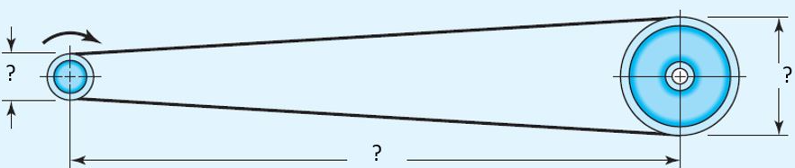
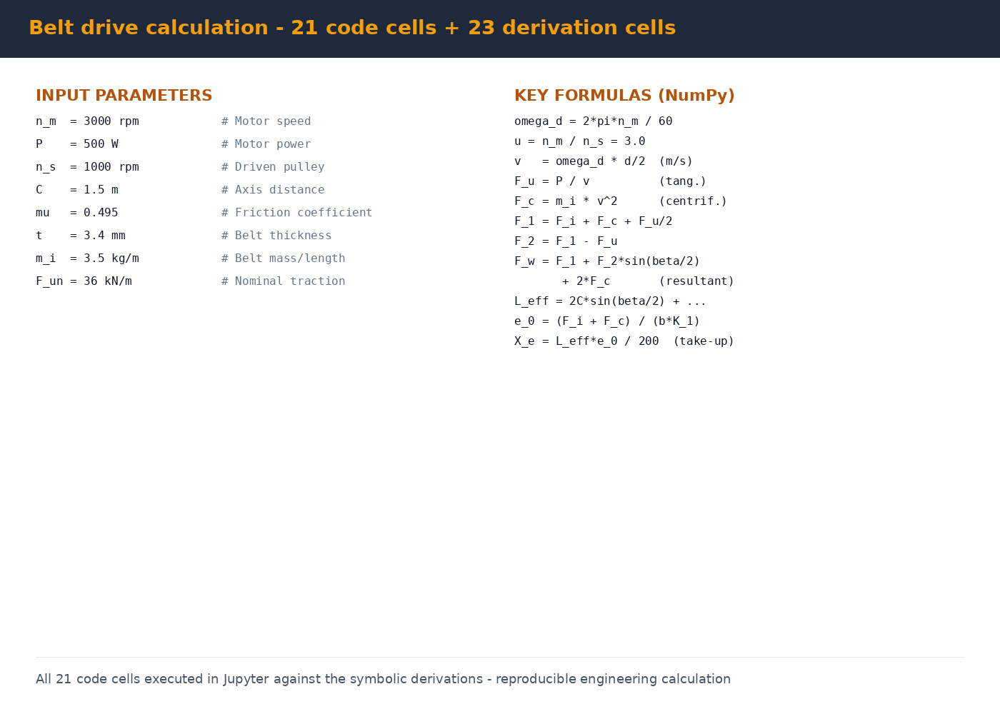

# 08 — Flat Belt Drive Design in Jupyter

> Plakansiksnas pārvada aprēķins — mašīnu elementu aprēķins Python vidē
> Mechanical-element design implemented as a reproducible Jupyter notebook

**Context** RTU · Mašīnu elementu (Machine Elements) course · RMCE01
**Tools** Jupyter Notebook · NumPy · LaTeX (markdown math)
**Format** 45 cells — 21 code + 23 markdown derivations

---

## Why a notebook instead of a spreadsheet

Mechanical-element design problems are classically done on paper or in Excel. I implemented this one as a **Jupyter notebook** for three reasons:

1. **Reproducibility** — change one input (say motor speed) and re-run; all downstream values update consistently. No copy-paste errors.
2. **Documented derivations** — every formula is written out in LaTeX in a markdown cell *before* the code cell that computes it. The notebook reads like a textbook chapter where every step is shown.
3. **Reusability** — the notebook becomes a template for any future flat-belt drive sizing exercise. Change the inputs, get a different design.

This approach scales — for more complex mechanical systems, the same pattern (LaTeX derivation → NumPy computation) makes the engineering reviewable and verifiable.

---

## The task

Design a flat-belt power transmission connecting two horizontally and parallel-mounted shafts. Given the motor speed and power, the driven shaft speed target, the axis distance and the belt material — compute:

- Required belt width, type and thickness
- Pre-tension, centrifugal and tight/slack-side forces
- Resultant force on the shafts (for bearing sizing)
- Effective belt length and required take-up

---

## The drive — geometric scheme



*Fig. 1 — Geometric scheme of the flat belt drive: driver pulley d, driven pulley D, axis distance C, wrap angle β. Two horizontally-mounted parallel shafts (1. att. in the notebook).*

Notation used throughout the notebook:
- `d`, `D` — driver and driven pulley diameters (m)
- `C` — center distance between shafts (m)
- `β` — wrap angle on the small pulley (radians)
- `n_m`, `n_s` — motor and driven shaft rotation speeds (rpm)
- `ω_d` — angular velocity of driver pulley (rad/s)
- `v` — belt linear velocity (m/s)
- `F_u`, `F_i`, `F_c`, `F_1`, `F_2`, `F_ω` — tangential, pre-tension, centrifugal, tight-side, slack-side, resultant forces (N)
- `L_eff` — effective belt length (m)
- `e_0`, `X_e` — belt elongation factor and required take-up (m)

---

## Inputs (with full justification in notebook)



*Fig. 2 — Input parameters (left) and the chain of NumPy-computed formulas (right) — from angular velocity through tensions to required take-up. Each formula has its derivation in a markdown cell above it.*

```python
n_m = 3000                # motora apgriezieni (motor speed, rpm)
P   = 500                 # motora jauda (motor power, W)
n_s = 1000                # dzenošā skriemeļa apgriezieni (driven pulley, rpm)
C   = 1.5                 # asu attālums (axis distance, m)
Ks  = 1.15                # darba režīma koeficients (service factor)
F_un = 36 * 1000          # siksnas nominālais aploces spēks (N/m belt width)
t = 3.4 / 1000            # siksnas biezums (belt thickness, m)
m_i = 3.5                 # siksnas īpatnējā masa (belt mass per meter, kg/m)
```

**Belt choice:** Habasit A3 general-purpose flat belt
- μ = 0.495 (working-surface friction coefficient — from manufacturer's brochure)
- t = 3.4 mm thickness
- m_i = 3.5 kg/m specific mass
- F_un = 36 kN/m nominal traction per meter of belt width

The drive ratio target u = n_m / n_s = 3.0 (motor 3000 rpm → driven shaft 1000 rpm).

---

## The calculation chain — 21 code cells in sequence

Each code cell computes one quantity from the previous ones. Selected highlights:

### Angular velocity of driver pulley
```math
ω_d = (2 · π · n_m) / 60
```
```python
import numpy as np
omega_d = (2 * np.pi * n_m) / 60      # rad/s
```

### Pulley diameters & wrap angle
Computed from drive ratio + axis distance, then verified against the limits for the belt material.

### Belt linear velocity
```math
v = ω_d · (d/2)
```
The standard kinematic relation — needed for centrifugal force calculation.

### Tangential, centrifugal and pre-tension forces

```math
F_u = P / v                  (tangential force, transmitted)
F_c = m_i · v²              (centrifugal, acts on both sides)
F_i = pre-tension force     (chosen to satisfy slip-free Euler equation with friction coefficient μ and wrap angle β)
```

### Tight-side and slack-side forces
```math
F_1 = F_i + F_c + F_u/2     (tight side)
F_2 = F_1 - F_u             (slack side)
```

### Resultant force on shafts (for bearing design)
```math
F_ω = F_1 + F_2 · sin(β/2) + 2 · F_c
```

This is the force the shafts must support — what the bearings have to be sized for.

### Effective belt length
```math
L_eff = 2C · sin(β/2) + π/2 · (d+D+4·t/2 + ((D-d)·(180-β)/180))
```

The full equation accounts for both straight runs and the curved sections wrapping around the pulleys, with a thickness correction.

### Belt elongation & required take-up
```math
e_0 = (F_i + F_c) / (b · K_1)
X_e = (L_eff · e_0) / (2 · 100)
```

Where `K_1` is the belt's specific stiffness factor and `b` is belt width.
The take-up `X_e` is the linear adjustment range the tensioning mechanism must provide.

---

## Files in this folder

| File | Size | What's inside | How to view |
|---|---:|---|---|
| `Plakansiksnas_parvada_aprekins.ipynb` | 324 KB | **Main notebook** — 45 cells, full design from inputs to take-up; LaTeX derivations + NumPy code; figures of the drive scheme and the Habasit A3 catalog page | **Jupyter Lab** or **Jupyter Notebook** |
| `Plakansiksnas_v31.ipynb` | 324 KB | Secondary version (slight iteration) | Same — Jupyter |
| `images/` | — | High-resolution figures used in this README | — |

---

## How to open & run

### Setup (one-time)
```bash
pip install jupyter numpy
```

### Open and run
```bash
cd 08_Belt_Drive_Calculation_Jupyter
jupyter notebook Plakansiksnas_parvada_aprekins.ipynb
```

This opens the notebook in your browser. Run cells in order with **Shift+Enter** — each markdown cell shows the derivation; each code cell computes the next quantity and prints it.

### Change a design parameter
Edit cell 5 (the inputs cell) — for example change `n_m = 3000` to `n_m = 2800` — then **Kernel → Restart & Run All** to re-compute everything downstream. All formulas, intermediate values and the final take-up update consistently.

---

## Skills demonstrated

- **Mechanical-element design** — flat belt power transmission
- **Belt-drive theory** — pre-tension, centrifugal, tight/slack-side forces, wrap-angle correction
- **Bearing-load calculation** — resultant force from belt on shafts
- **LaTeX-documented engineering math** — every formula shown before its code
- **NumPy numerical computation**
- **Jupyter as an engineering notebook** — reproducible, parameter-driven calculation that re-runs cleanly
- **Manufacturer-catalog reading** — extracted Habasit A3 parameters (μ, t, m_i, F_un) and integrated into design

---

## Latvian summary (LV)

Šis projekts ir plakansiksnas pārvada pilns aprēķins divām horizontāli un paralēli novietotām vārpstām, kas realizēts kā Jupyter Notebook ar NumPy. Notebook satur 45 šūnas — 21 koda + 23 markdown ar LaTeX formulām, kur katra formula ir parādīta *pirms* tās aprēķina.

**Ieejas dati:**
- n_m = 3000 rpm (motora apgriezieni)
- P = 500 W (motora jauda)
- n_s = 1000 rpm (dzenamais skriemelis)
- C = 1,5 m (asu attālums)
- Siksna: Habasit A3 vispārēja pielietojuma (μ = 0,495, t = 3,4 mm, m_i = 3,5 kg/m, F_un = 36 kN/m)

**Aprēķinātie izejas dati:**
- Dzenošā skriemeļa leņķiskais ātrums ω_d
- Siksnas parametri: veids, platums, biezums
- Spriegošanas spēks F_i, centrbēdzes spēks F_c
- Spēki abām pusēm F_1, F_2 un rezultējošais spēks uz vārpstām F_ω (gultņu izvēlei)
- Siksnas efektīvais garums L_eff (ar liekuma korekciju)
- Nepieciešamā siksnas savilkšana X_e

Notebook ir parametrizēta — mainot vienu ievades vērtību (piem. motora apgriezienus) un izpildot atkārtoti, visi atvasinātie lielumi tiek pārrēķināti automātiski.
