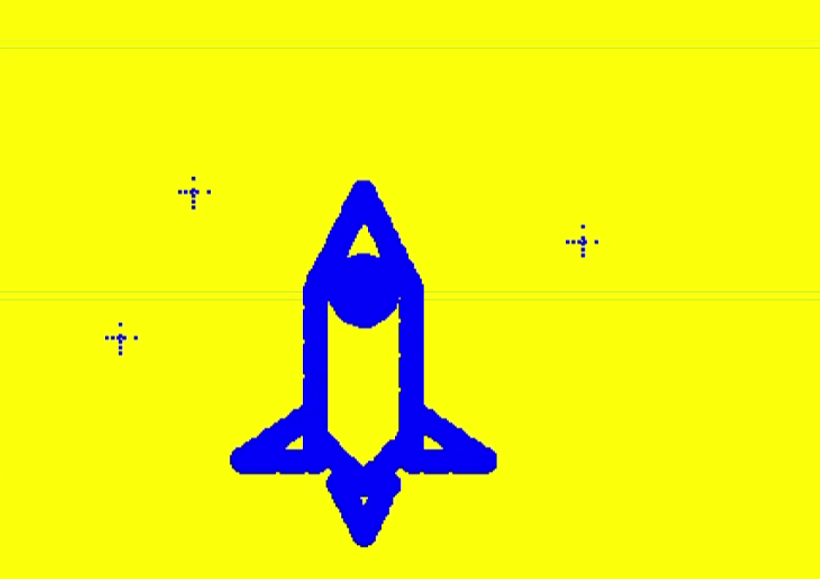
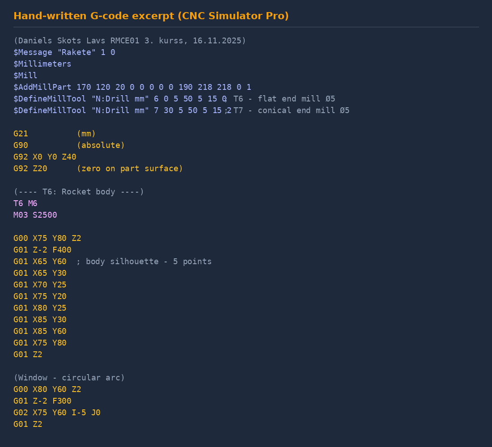

# 09 — CNC Milling: Hand-Written G-code

> Laboratorijas darbs: CNC frēzes programmēšana G-kodos
> Hand-written G-code program for CNC milling — rocket-with-stars pattern

**Context** RTU studiju projekts · RMCE01 · 3rd year · 16.11.2025
**Software** CNCSimulator Pro
**Machine simulated** HobbyMill (vertical CNC milling machine)
**Workpiece** 150 × 100 × 20 mm

---

## The exercise

Hand-write a complete G-code program from scratch that machines a recognizable pattern — "rocket with stars" — on a 150 × 100 × 20 mm workpiece, using **two cutting tools**:

- **T6** — Ø5 mm cylindrical flat end mill (for the rocket body and contours)
- **T7** — Ø5 mm conical / pointed end mill (for the stars)

The result is verified in CNC Simulator Pro, which renders the toolpath, the workpiece geometry, and the resulting cut surface in 3D.

This is foundational CNC programming — no CAM software involved. Just G-code typed manually, line by line, including all the bookkeeping commands a real CNC machine requires.

---

## The result



*Fig. 1 — Final result in CNC Simulator Pro after all T6 and T7 passes complete: rocket body with windows and wings (T6), five stars (T7). The 3D rendering shows the cut surfaces on the 150 × 100 × 20 mm workpiece.*

---

## The G-code structure

The program has four sections, in order:

### 1. CNC Simulator Pro setup commands

These are `$`-prefixed commands specific to CNC Simulator Pro that define the simulation environment before any G-code runs:

```
(Daniels Skots Lavs RMCE01 3. kurss, 16.11.2025)
$Message "Raķete" 1 0           (Detail name)
$Millimeters                    (Use mm scale)
$Mill                           (Use milling station)
$AddMillPart 170 120 20 0 0 0 0 0 190 218 218 0 1   (Define workpiece)
$DefineMillTool "N:Drill mm" 6 0 5 50 5 15 0        (T6: Ø5 flat end mill)
$DefineMillTool "N:Drill mm" 7 30 5 50 5 15 2       (T7: Ø5 conical end mill)
$ReadTasDefinedTool             (Allow T command to use defined tools)
```

### 2. Initialization

```gcode
G92 Z20            (Tool offset for clearance height)
T6 M6              (Select T6)
M03 S2500 F50      (Spindle on @ 2500 rpm, feed 50 mm/min)

G21                (Metric units - mm)
G90                (Absolute coordinates)
G92 X0 Y0 Z40
G92 Z20            (Zero on the workpiece surface)
```

### 3. T6 — rocket body, window, wings, flame

The body is a closed contour with five corner points, executed with linear `G01` moves at F400:

```gcode
T6 M6
M03 S2500

(Body contour - 5-point silhouette)
G00 X75 Y80 Z2     (rapid to start)
G01 Z-2 F400       (plunge down to depth)
G01 X65 Y60        (top-left)
G01 X65 Y30        (left side)
G01 X70 Y25
G01 X75 Y20        (bottom point)
G01 X80 Y25
G01 X85 Y30        (right side)
G01 X85 Y60        (top-right)
G01 X75 Y80        (back to start)
G01 Z2             (retract)
```

The **window** is a circular arc done with `G02` clockwise circular interpolation:

```gcode
(Window - circular arc)
G00 X80 Y60 Z2
G01 Z-2 F300
G02 X75 Y60 I-5 J0    (G02 with I/J center offset)
G01 Z2
```

Wings (left + right) are symmetric three-point linear contours. The flame at the bottom is a triangular profile.

### 4. T7 — five stars at different positions

```gcode
T7 M6
M03 S2500

(Star 1 - top-left)
G00 X40 Y77 Z2
G01 Z-2 F300
G01 X40 Y83        (vertical line)
G01 Z2
G00 X37 Y80 Z2
G01 Z-2 F300
G01 X43 Y80        (horizontal line - cross with vertical)
G01 Z2
```

Each star is a two-line cross (horizontal + vertical) made with the conical tool — gives the characteristic "star" appearance. Five stars at five positions around the rocket.



*Fig. 2 — Syntax-highlighted excerpt of the G-code program: setup commands, header, T6 tool change, rocket body contour and G02 arc for the window*

---

## Cutting parameters

| Parameter | Value | Why |
|---|---|---|
| Spindle speed | 2500 rpm | Reasonable for Ø5 end mills in soft material |
| Feed (body) | 400 mm/min | Standard contour milling |
| Feed (windows / wings) | 300–350 mm/min | Slower for accuracy on detail features |
| Depth of cut | 2 mm | Single full-depth pass at 2 mm |
| Workpiece zero | Top-center of stock | `G92 X0 Y0 Z40` then `G92 Z20` on surface |

---

## G & M codes used

| Code | Meaning | Where |
|---|---|---|
| `G21` | Metric (mm) | Header |
| `G90` | Absolute positioning | Header |
| `G92` | Set coordinate system (work offset) | Header / clearance |
| `G00` | Rapid traverse | Position moves |
| `G01` | Linear interpolation (cutting) | Contour cuts |
| `G02` | Circular interpolation (clockwise) | Window arc |
| `M03` | Spindle on, clockwise | Each tool start |
| `M06` | Tool change | `T6 M6` / `T7 M6` |

---

## Files in this folder

| File | Size | What's inside | How to view |
|---|---:|---|---|
| `CNC_Lab_Daniels_Skots_Lavs.doc` | 84 KB | **The full lab report** with the complete G-code program, screenshots from CNC Simulator Pro and tool definitions | Microsoft Word, LibreOffice |
| `CNC_Lab_text.txt` | 2.3 KB | Text-only excerpt of the G-code program for direct copy-paste into CNC Sim Pro | Any text editor |
| `1001.nc`, `1002.nc` | 99 / 137 KB | Additional G-code samples from CAM (Fusion 360 / 2D Contour outputs, T23 ball end mill) | Any text editor or CNC simulator |
| `images/` | — | Figures used in this README | — |

---

## How to open & run

### View the report
Open `CNC_Lab_Daniels_Skots_Lavs.doc` in Word or LibreOffice for the full narrative with screenshots.

### Run the G-code in CNC Simulator Pro
1. Install **CNC Simulator Pro** (free demo / paid full version from CNCSimulator.com)
2. Launch and select **Mill** mode
3. **File → New** to start with a blank workpiece
4. Paste the G-code from `CNC_Lab_text.txt` into the editor — or open the `.doc` and copy from there
5. Click **Compile** (verifies syntax)
6. Click **Run** to simulate — the workpiece rotates in 3D and the cutting tool traces the path, removing material as it goes
7. Speed up / slow down with the speed slider; pause to inspect a specific move

---

## Skills demonstrated

- **Manual G-code programming** — writing complete CNC programs by hand without CAM
- **G-code instructions** — G00/G01/G02 (rapid / linear / circular), G21/G90 (units / mode), G92 (offsets)
- **M-codes** — M03 (spindle on), M06 (tool change)
- **CNC Simulator Pro setup commands** — `$Mill`, `$AddMillPart`, `$DefineMillTool`, etc.
- **Tool / feed / speed selection** per operation type
- **Multi-tool job sequencing** — T6 contours then T7 detail features
- **Work-coordinate system setup** — `G92` offsets, zero on workpiece surface
- **Cutting strategy** — separating rough/finish, choosing depth and feed per feature

---

## Latvian summary (LV)

Šis ir CNC frēzes programmēšanas laboratorijas darbs (RTU, 3. kurss, 16.11.2025), kurā raķete ar zvaigznēm tika izstrādāta uz 150 × 100 × 20 mm sagataves, izmantojot manuāli rakstītu G-kodu CNC Simulator Pro vidē.

**Izmantotie instrumenti:**
- T6 — Ø5 mm cilindriskā gala frēze ar plakanu galu (korpuss, kontūra, spārni)
- T7 — Ø5 mm konusveida frēze (piecas zvaigznes)

**Programmas struktūra:**
1. CNC Simulator Pro definīcijas (`$Mill`, `$AddMillPart`, `$DefineMillTool`)
2. Galvene: `G21` (mm), `G90` (absolūtais), `G92` darba nullpunkts
3. T6 sekcija ar M03 ieslēgšanu, raķetes korpusa lineāro kontūru, G02 apļveida loku logam, spārniem un liesmai
4. T7 sekcija ar zvaigžņu krustveida līnijām piecās pozīcijās

Pilns G-koda pirmkods iekļauts failā `CNC_Lab_text.txt` un detalizētajā Word atskaitē `CNC_Lab_Daniels_Skots_Lavs.doc`.
