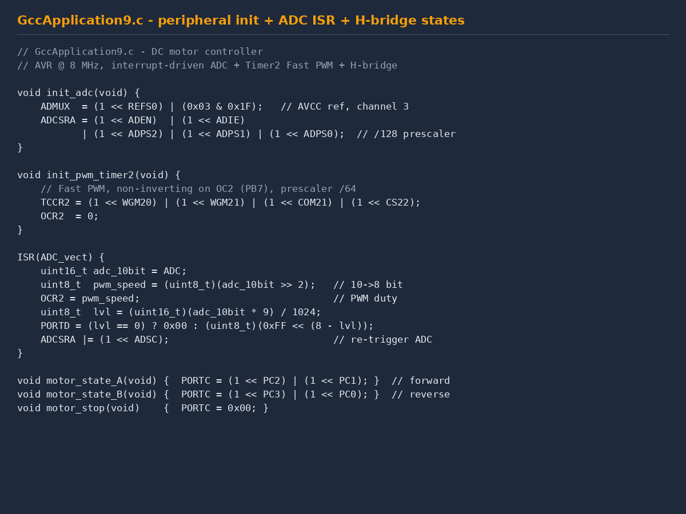

# 10 — AVR Microcontroller: 9 C Programs + Proteus Simulation

> Mikrokontroleru programmēšana C valodā (AVR / Microchip Studio) ar Proteus simulāciju
> Nine progressive C programs from blinking LEDs to closed-loop DC motor control

**Context** RTU studiju projekti · RMCE01 · 3rd year · October–December 2025
**Toolchain** Microchip Studio (AVR-GCC) · Proteus Design Suite
**Target** Atmel AVR (8-bit), F_CPU = 1 MHz or 8 MHz depending on program

---

## The progression

Nine C programs written over three months that walk from the absolute basics of GPIO and button reading to a complete closed-loop DC-motor control system with ADC, PWM, H-bridge and LED bar graph. All programs use the AVR runtime headers (`avr/io.h`, `avr/interrupt.h`, `util/delay.h`), are configured at the register level (not Arduino abstractions), and are simulated in Proteus before any hardware flashing.

| # | Date | Topic | Techniques |
|---|---|---|---|
| 1 | 01.10.2025 | LED running light + START/STOP | GPIO, button polling, software debounce |
| 2 | 22.10.2025 | RESET / START / STOP control | 3-button state machine |
| 3 | 22.10.2025 | Timer-overflow interrupt | `ISR(TIMER0_OVF_vect)`, `sei()` |
| 4 | early 11.2025 | Intermediate exercise | — |
| 5 | 29.10.2025 | Timer-compare interrupt | `ISR(TIMER0_COMP_vect)`, CTC mode, F_CPU = 1 MHz |
| 6, 7, 8 | mid 11.2025 | Intermediate exercises | — |
| **9** | **19.11.2025** | **DC motor controller — ADC + PWM + H-bridge** | **Full closed-loop system (highlight)** |

---

## The flagship — GccApplication9: closed-loop DC motor controller

A complete embedded system on AVR (F_CPU = 8 MHz) that combines **four peripherals** working in coordination:



*Fig. 1 — `GccApplication9.c` excerpts: ADC + Timer2 Fast PWM init at the register level; `ADC_vect` ISR maps the 10-bit ADC reading to an 8-bit PWM duty cycle and a LED bar-graph mask, then re-triggers the next conversion; H-bridge direction states drive PC0–PC3.*

### Hardware
- **AVR microcontroller** at 8 MHz
- **Potentiometer** on ADC channel 3 (PF3) — sets motor speed
- **DC motor** controlled via an external **H-bridge** wired to PC0–PC3
- **PWM output** on OC2 (PB7) — controls motor speed via duty-cycle
- **8 LEDs** on PORTD — bar-graph visual indicator of current speed
- **2 buttons** on PB0/PB1 — direction selection (forward / reverse / stop)

### Peripheral configuration

```c
// ADC: 10-bit, AVCC reference, channel 3, interrupt-driven, /128 prescaler
void init_adc(void) {
    ADMUX  = (1 << REFS0) | (0x03 & 0x1F);
    ADCSRA = (1 << ADEN)  | (1 << ADIE)
           | (1 << ADPS2) | (1 << ADPS1) | (1 << ADPS0);
}

// Timer2: Fast PWM, non-inverting on OC2 (PB7), prescaler /64
void init_pwm_timer2(void) {
    TCCR2 = (1 << WGM20) | (1 << WGM21) | (1 << COM21) | (1 << CS22);
    OCR2  = 0;
}
```

### The ADC ISR — the heart of the system

```c
ISR(ADC_vect) {
    uint16_t adc_10bit = ADC;

    // Map 10-bit ADC to 8-bit PWM duty
    uint8_t pwm_speed = (uint8_t)(adc_10bit >> 2);
    OCR2 = pwm_speed;

    // 9-level bar graph: lvl = 0..8 → mask = 0xFF << (8 - lvl)
    uint8_t lvl = (uint16_t)(adc_10bit * 9) / 1024;
    uint8_t led_mask = (lvl == 0) ? 0x00 : (uint8_t)(0xFF << (8 - lvl));
    PORTD = led_mask;

    // Re-trigger the next conversion
    ADCSRA |= (1 << ADSC);
}
```

The trick: **the ISR re-triggers the ADC at the end** (`ADCSRA |= (1 << ADSC)`). This creates a continuous sampling loop without polling. The main loop stays free to handle button input and direction state.

### H-bridge state machine

Three motor states, each just a direct write to PORTC selecting two transistors:

```c
void motor_state_A(void) {  PORTC = (1 << PC2) | (1 << PC1); }  // forward
void motor_state_B(void) {  PORTC = (1 << PC3) | (1 << PC0); }  // reverse
void motor_stop(void)    {  PORTC = 0x00; }
```

### Button-debounce + direction selection

```c
void handle_motor_control(void) {
    uint8_t current_pinb = PINB;

    if (!(current_pinb & (1 << PB0))) {
        _delay_ms(50);                              // first-debounce
        if (!(PINB & (1 << PB0))) {                 // re-read after delay
            motor_direction_state = 1;              // forward
        }
    }
    else if (!(current_pinb & (1 << PB1))) {
        _delay_ms(50);
        if (!(PINB & (1 << PB1))) {
            motor_direction_state = 2;              // reverse
        }
    }

    if      (motor_direction_state == 1) motor_state_A();
    else if (motor_direction_state == 2) motor_state_B();
    else                                  motor_stop();
}
```

The classic "delay + re-read" pattern eliminates bouncing without a hardware debounce circuit. Reading the pin twice 50 ms apart and only acting if both reads agree guarantees a true press.

---

## What the system does

1. Operator turns the **potentiometer**
2. ADC samples it continuously (interrupt-driven, ~7800 samples/sec at /128 prescaler)
3. Sample value sets **OCR2** → PWM duty → motor speed proportionally
4. Sample value also sets the **LED bar graph** mask → 0–8 LEDs lit
5. Operator presses **forward** or **reverse** button → H-bridge switches → motor direction flips
6. Without buttons → motor stops (debounced state ignores transient noise)

This is a complete embedded control system — sensor input, real-time conversion, PWM actuator output, state machine, debouncing, visual feedback — all on an 8-bit MCU.

---

## Files in this folder

### Source code (`code/`)

| File | Topic |
|---|---|
| `01_pr_darbs_LED_running_light.c` | First practical work (01.10.2025) — LED running light with START/STOP buttons |
| `02_LED_reset_start_stop.c` | 3-button state machine (RESET / START / STOP) |
| `03_timer_overflow_isr.c` | Timer0 overflow ISR |
| `04_app3.c`, `05_app4.c`, `07_app6.c`, `08_app8.c` | Intermediate exercises |
| `06_timer_compare_isr.c` | Timer0 CTC compare ISR (F_CPU = 1 MHz) |
| `09_motor_control_ADC_PWM_Hbridge.c` | **Flagship — DC motor controller** |

### Proteus simulations (`proteus/`)

| File | What it simulates |
|---|---|
| `2_pr_darbs.pdsprj` | Practical work 2 — schematic with AVR + LEDs + buttons + display |
| `3_pr_darbs.pdsprj` | Practical work 3 — schematic with AVR + timers |
| `4_pr_darbs.pdsprj` | Practical work 4 |
| `laboratorijas_5.pdsprj` | Lab 5 circuit (December 2025) |

---

## How to open & run

### View the source code
Any text editor works (Notepad++, VS Code) — `.c` files are plain ASCII.

### Compile and simulate
**Software needed:**
- **Microchip Studio** (free from Microchip — the official AVR IDE, formerly Atmel Studio)
- **Proteus Design Suite** (Labcenter Electronics) — for the `.pdsprj` simulations

**Steps:**
1. In Microchip Studio: **File → New → Project → GCC C Executable Project**, target device `ATmega16` (or whatever the original was)
2. Replace the generated `main.c` with the chosen `.c` from `code/`
3. **Build → Build Solution** (F7) — produces a `.hex` file
4. Open the `.pdsprj` in Proteus
5. Right-click the AVR in the Proteus schematic → **Edit Properties** → set `Program File` to the `.hex` from step 3
6. Click **Play** in Proteus → the simulation runs with the AVR executing the compiled code, LEDs blinking, buttons responsive, ADC reading the simulated potentiometer

### Just read the code
The source is well-commented and the patterns are explicit — every register is named in a comment so even without running it the intent is clear.

---

## Skills demonstrated

- **AVR C programming** — datasheet-level coding, not Arduino abstractions
- **Register-level GPIO** — `DDRx`, `PORTx`, `PINx` direct configuration
- **ADC** — interrupt-driven continuous sampling, AVCC reference, prescaler choice, channel selection
- **Timer/PWM** — Timer2 Fast PWM mode, OC2 output, OCR2 duty control, prescaler selection
- **Timer interrupts** — overflow and compare-match ISRs
- **CTC mode** for Timer0
- **Interrupt service routines (ISRs)** — `sei()`, vector names, ISR-safe code
- **Bitwise register manipulation** — `(1 << BIT_NAME)` patterns throughout
- **H-bridge motor direction control** with state machine
- **Button debouncing** without hardware — software delay + re-read
- **PWM duty-cycle control from sensor input** — closed-loop in 4 instructions
- **LED bar graph display** — mathematical mask `0xFF << (8 - lvl)`
- **Proteus circuit simulation**
- **Microchip Studio toolchain** workflow

---

## Latvian summary (LV)

Šis ir AVR mikrokontroleru programmēšanas kursa darbu komplekts (RTU, 3. kurss, oktobris–decembris 2025) — deviņas C valodas programmas, kas progresē no LED mirgošanas līdz slēgtas cilpas līdzstrāvas motora vadībai. Visas programmas rakstītas reģistru līmenī (nevis Arduino abstrakcijas), debugētas Proteus vidē pirms ielādes.

**Flagships projekts — GccApplication9 (19.11.2025):** pilna ieguldītā sistēma uz AVR @ 8 MHz, kas apvieno četrus periferijas modeļus:
- **ADC** — 10-bit, AVCC bāze, kanāls 3, pārtraukuma vadīta nepārtraukta konversija (`ADC_vect` ISR pati pārstartē nākamo konversiju)
- **Timer2 Fast PWM** — non-inverting OC2 izeja uz PB7, OCR2 aizpildījums no ADC nolasījuma (10→8 bit pārveidošana ar `>> 2`)
- **LED bar graph** — 8 LED uz PORTD, līmenis ar maskas pieeju `0xFF << (8 - lvl)`
- **H-tilta vadība** — PC0–PC3, virziena valstu mašīna (stāvoklis A / B / Stop)
- **Pogu debounce** — 50 ms aizture un atkārtota nolasīšana uz PB0/PB1

Pirmkods atrodas `code/` apakšmapē. Proteus simulācijas `.pdsprj` faili — `proteus/`. Atveramas attiecīgi ar Microchip Studio un Proteus Design Suite.
