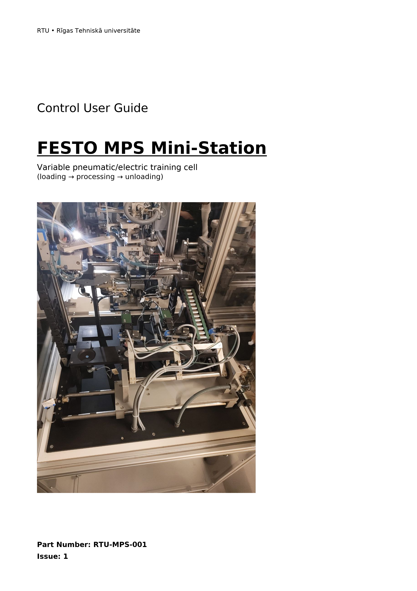
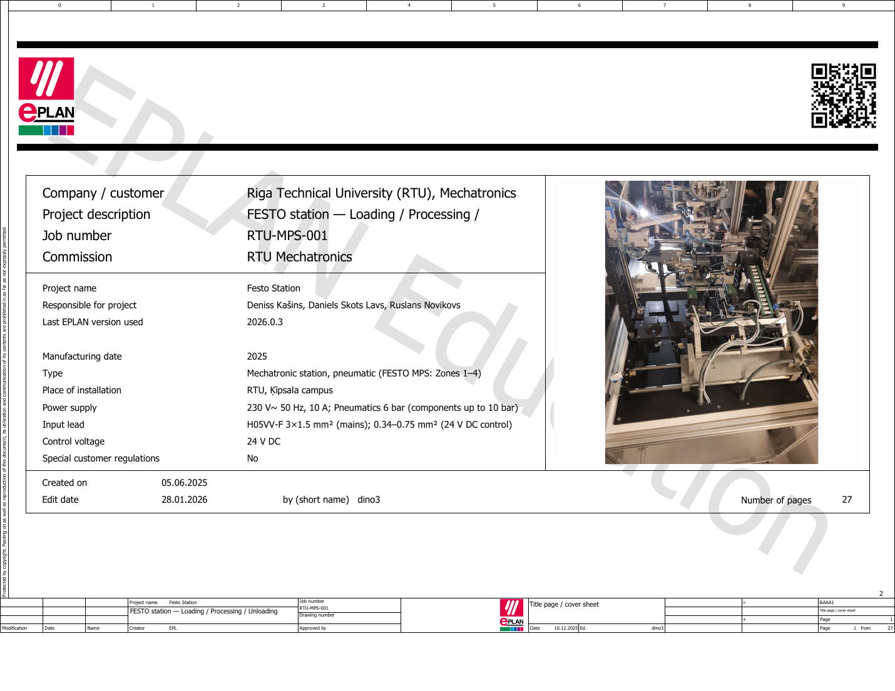
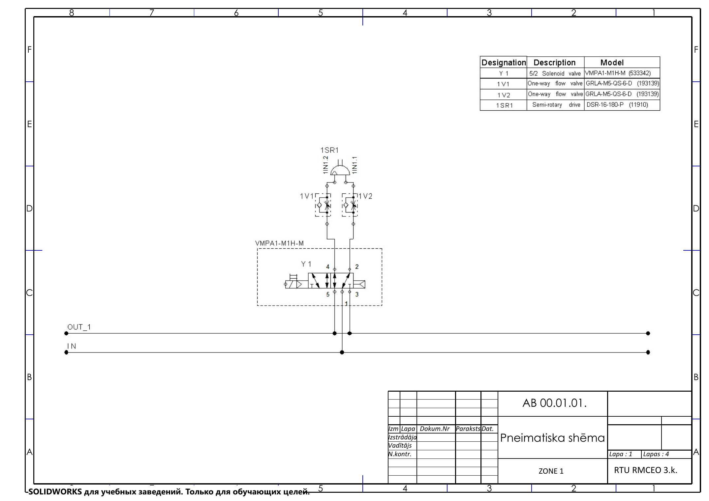
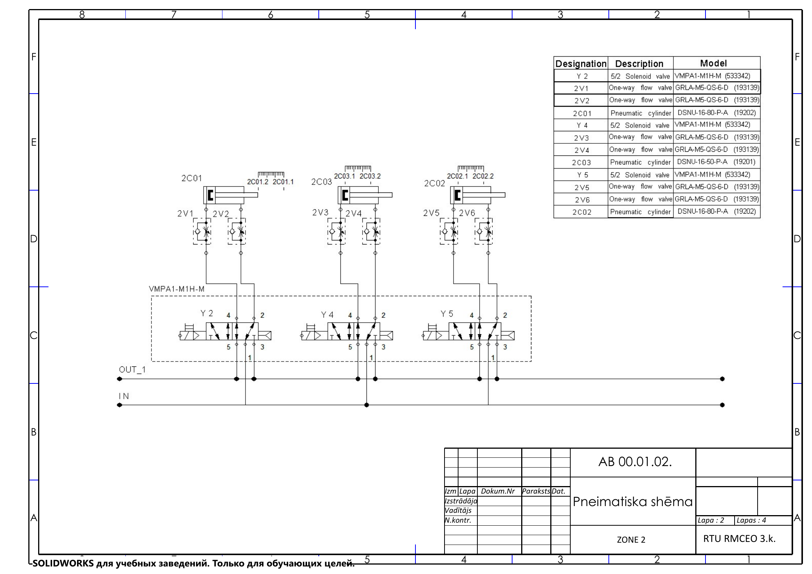
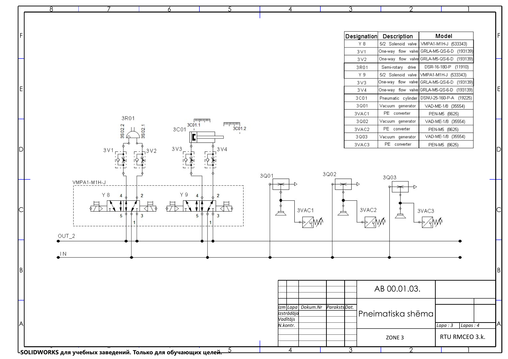
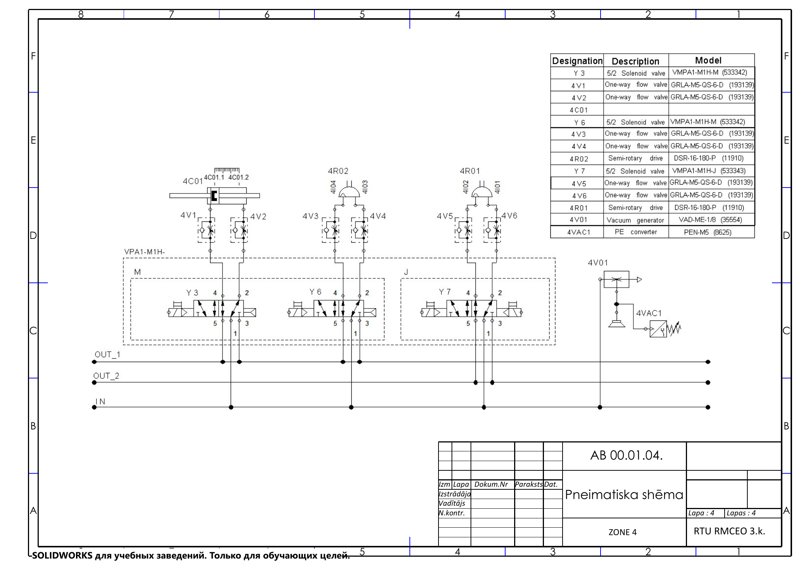
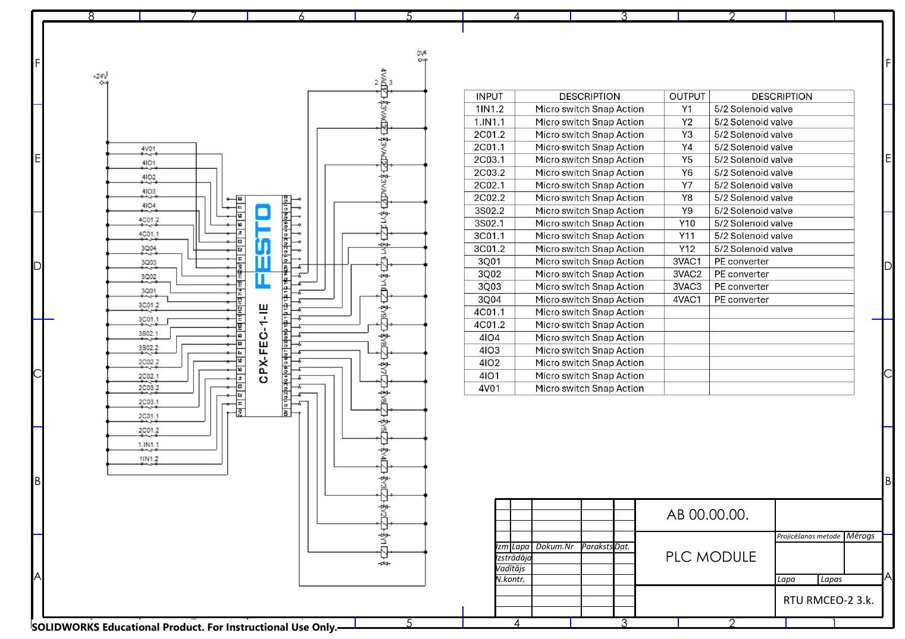
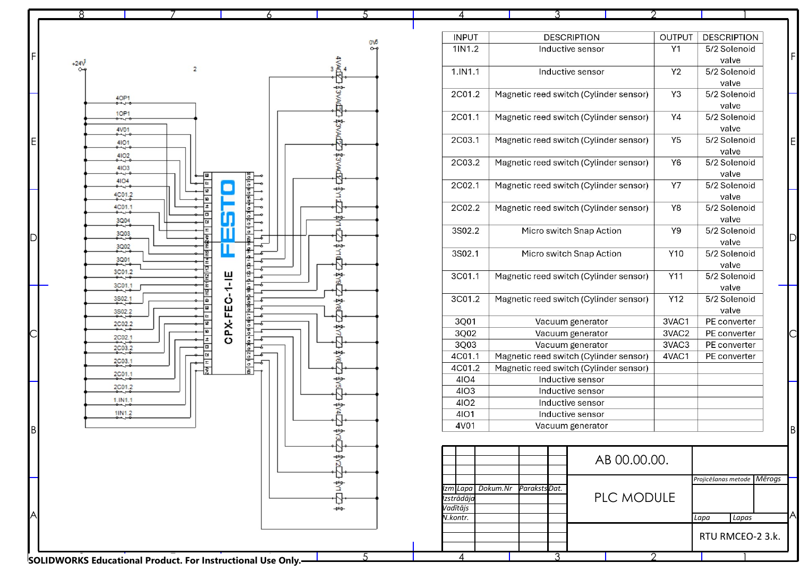

[← back to portfolio](../README.md)

# 🏁 Project 11

---

# 11 — FESTO MPS Station: Repair, EPLAN Schematics & Documentation 🏁

> Reālas Festo MPS izglītības stacijas remonts, diagnostika un pilnas tehniskās dokumentācijas izveide
> Real-equipment maintenance project — restoring a non-working FESTO MPS station and producing full schematics

**Context** RTU's FESTO MPS station — needed repair and was undocumented
**Role** Co-authored the repair and the technical documentation handbook; drafted electrical schematics in EPLAN
**Team** Daniel + Denis Kashin (PLC subsystem co-prepared)
**Tools** EPLAN Education 2026 · Festo Automation Suite · CODESYS · SIMATIC Manager · pneumatic/electrical analysis

---

## Why this is the flagship project

This is the project that maps **closest to real industrial work** — and most closely mirrors my role as Industrial Electronics Technician (*Elektronikas regulētājs*) at Latvijas Finieris. Unlike the simulation-based projects (RobotStudio, FluidSIM, Proteus), this one involved:

- A **real broken physical machine** in the RTU lab
- A **real diagnosis** — finding what was wrong without existing schematics to reference
- **Real EPLAN schematic drafting** — drawing what was there from scratch
- **Real handoff documentation** — writing the maintenance handbook the next student/technician will use
- **Real team collaboration** with another student on the PLC subsystem

Every other project in this portfolio is something I designed and simulated. This is the one where I **restored a real machine to service** and **produced the documentation that didn't exist**.

---

## The system — FESTO MPS Modular Production System

*Fig. 1 — The actual rebuilt FESTO MPS station (cover photo from the handbook). Four-zone training cell: loading → processing → pickup head with vacuum gripper → unloading. Variable pneumatic/electric trainer typical of educational environments.*

The MPS station has **four working zones**, each with its own actuators, sensors and pneumatic supply:

### Zone 1 — Loading

| ID | Component | Model | Function |
|---|---|---|---|
| 1I01 | Inductive sensor "PART IN" | SIE-M12S-RS-S-L (PNP, 10–30 VDC) | Detects part arrival at conveyor entry |
| 1R01 | Pneumatic rotary drive (semi-rotating) | Festo DSR-25-180-P (Series 0788) | Workpiece orientation/transfer |
| 1I02 | Position sensors (×2) on rotary | SIE-M8x1-PS-K / SIE-M12x1-PS-K-LED | End-of-travel detection |
| 1M01 | Conveyor motor | M1 | 24 V DC — transports parts to processing |
| 1OP01 | Optical sensor for parts-on-line limit | — | Drive boundary / fullness monitor |

### Zone 2 — Processing

The processing zone has the **F module** (tool feed) and the **H module** (cross-transmission). Both use pneumatic cylinders with magnetic reed switches (Festo SMT-8-K-LED) sensing end positions on both extend and retract directions, plus cross-stroke for the H module.

Controlled via:
- `2V01` / `2V02` — directional control valves
- `2G01` — GRLA flow regulators (speed control on each motion direction)

### Zone 3 — Pickup head with vacuum gripper

| ID | Component | Model | Function |
|---|---|---|---|
| 3Q01 | Vacuum block | Festo 151270, VAL-1/8-10 (6–8 bar) | Vacuum gripping for transfer |
| 3C01 | Lift-axis pneumatic cylinder | Festo DSNU/DNC series | Gripper head lift/lower |
| 3S01 | Magnetic stroke sensors on lift | SMT-8-K-LED | End-of-travel detection |
| 3V01 | Lift-axis solenoid valve | Festo VUVG-L10-P53C-T-M5-1P3 (24 VDC) | Cylinder direction control |
| 3R01 | Intermediate rotary drive | Festo DSR-25-180-P | Part reorientation between sections |
| 3S02 | Rotary end-position limit switches | BURGESS U33 | Hard-stop detection |

### Zone 4 — Unloading
Documented in same format as Zones 1–3 in the handbook.

---

## The tagging convention — the methodology contribution

To make the documentation usable by future maintainers, I designed a structured tagging convention applied throughout:

**Format:** `[Zone][Class][Number]`

- **Zone** — 1, 2, 3, or 4 (which physical zone the component is in)
- **Class** — letter encoding the component type:
  - `I` — inductive sensor
  - `OP` — optical sensor
  - `S` — other sensors (magnetic, mechanical limit switches)
  - `C` — cylinder
  - `R` — rotary drive
  - `V` — valve (including solenoid)
  - `G` — throttle/flow regulator (GRLA)
  - `M` — motor
  - `Q` — vacuum block (ejector / cup)
  - `T` — MiniTool actuator
- **Number** — running serial within zone+class

**Example:** `2P3.1` = Zone 2, magnetic Position sensor, set 3 channel 1 — unambiguous and instantly traceable in both schematic and physical inspection.

A separate legend (zones + classes) opens the handbook so the convention is self-explanatory.

---

## The deliverables

### 1. EPLAN electrical wiring

*Fig. 2 — Main electrical wiring schematic (EPLAN Education 2026 output): 24 V power distribution and sensor / actuator I/O for all four zones, drawn from scratch by tracing the rebuilt hardware.*

The electrical schematic captures:
- Main 24 V DC power distribution
- Sensor inputs (all 16+ sensors across the 4 zones)
- Valve and motor outputs
- PLC I/O assignments
- Cabinet terminal wiring

### 2. Four pneumatic schematics — one per zone

*Fig. 3 — Pneumatic sheet 1 of 4: zone 1 (loading) — valve manifold → actuator routing for the rotary drive and conveyor*

*Fig. 4 — Pneumatic sheet 2 of 4: zone 2 (processing) — F and H modules*

*Fig. 5 — Pneumatic sheet 3 of 4: zone 3 (pickup head) — vacuum block, lift cylinder, intermediate rotary*

*Fig. 6 — Pneumatic sheet 4 of 4: zone 4 (unloading)*

### 3. PLC wiring diagrams

*Fig. 7 — Main PLC wiring diagram*

*Fig. 8 — PLC subsystem — co-prepared with team-mate Denis Kashin. The PLC subsystem split made the work parallel-friendly and is the team-collaboration evidence.*

### 4. Technical documentation handbook (~2 600 words, LV)

The `FESTO_MPS_full_documentation.docx` is the **handbook** future technicians and students