

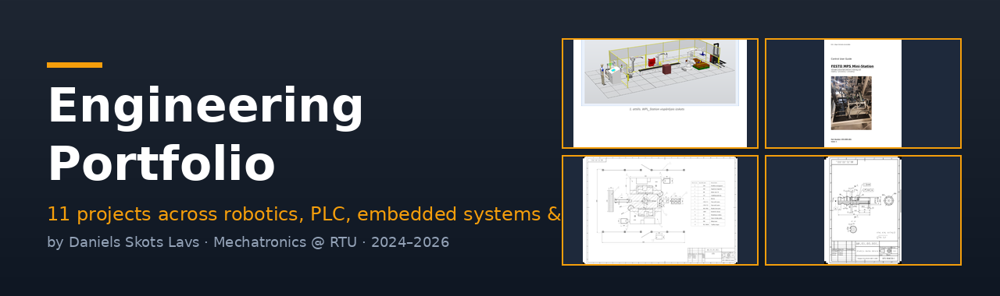

# Engineering Portfolio · Daniels Skots Lavs

*Mechatronics Student · Industrial Electronics Technician*

[-1E293B?style=flat-square&logo=academia&logoColor=F59E0B)](#)

---

## 👋 About

I'm a 4th-year Mechatronics student at **Riga Technical University** (GPA 9.21 / 10) working in parallel as an **Industrial Electronics Technician at Latvijas Finieris**. This repository collects 11 engineering projects I completed during my studies and side work — spanning industrial robotics, PLC programming, embedded systems, precision metrology, CNC machining, mechanical design and full-stack programming.

Each project has its own folder with a detailed README (background, methods, file-by-file breakdown, embedded figures, how-to-run instructions) and the **full original source files** — drawings, CAD models, simulation files, source code, technical reports.

> 🦾 **Newest work lives in a separate repo:** [**so101-native-ubuntu-ros2-moveit**](https://github.com/Lavs-Daniels-Skots-231RMC173/so101-native-ubuntu-ros2-moveit) — a real-hardware SO-101 robot arm on **ROS 2 Jazzy + MoveIt**.

---

## 🔧 Tech Stack

**CAD & 3D**

**Industrial Automation**

**Robotics & Simulation**

**Embedded**

**Software**

**Metrology**

---

## 📂 Featured Projects

> Each card links to the project's folder with a detailed README, source files and reports.

<table>
<tr>
<td width="50%" valign="top">

### [🏁 11 · FESTO MPS Station](11_FESTO_MPS_Station_Maintenance/)

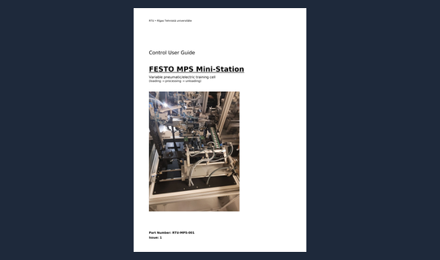

**Flagship · Real-equipment maintenance**

Restored a non-working FESTO MPS training cell to service: drew complete EPLAN electrical & PLC schematics from scratch, 4 pneumatic-system sheets, and authored a 2,600-word technical handbook with custom `[Zone][Class][Number]` tagging convention.

`EPLAN` `Festo` `Pneumatics` `Team project`

</td>
<td width="50%" valign="top">

### [🤖 01 · WPL_Station](01_WPL_Station/)

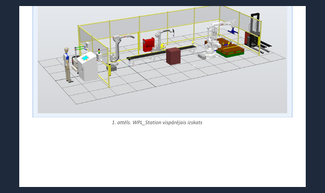

**3-robot welding & palletizing line**

ABB RobotStudio simulation with IRB 2600 / 1660ID / 460 on three virtual controllers. 5 RAPID modules, 8 Smart Components, 25+ Station Logic signals, adaptive HIGH/LOW trajectory selection by height sensor.

`ABB RAPID` `Smart Components` `RobotStudio 2023`

</td>
</tr>
<tr>
<td width="50%" valign="top">

### [🏭 03 · RTK 4.7 Cell Design](03_Robotic_Manufacturing_Cell/)

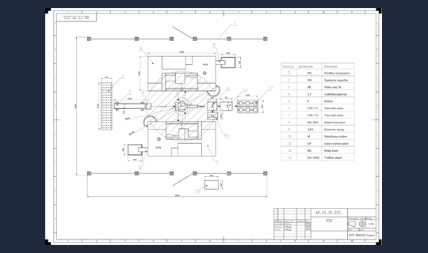

**Mass-production cell — 180 000 pcs/year**

End-to-end design of a 6.5 × 9.5 m robotic machining cell for an M30 shaft in steel C45. 13-position layout, 2× turn-mill CNC, full cycle-time analysis, cyclogram, technological route and cutting-regime calculations.

`MAB373 course work` `Industrial layout` `CNC turn-mill`

</td>
<td width="50%" valign="top">

### [⚙️ 10 · AVR Motor Controller](10_AVR_Microcontroller_Proteus/)

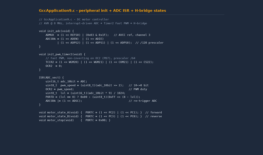

**Embedded DC motor controller with ADC + PWM + H-bridge**

Closed-loop motor control on AVR @ 8 MHz: interrupt-driven ADC + Timer2 Fast PWM + H-bridge direction state machine + 8-LED bar graph. Part of a 9-program progression simulated in Proteus.

`AVR C` `ISRs` `Microchip Studio` `Proteus`

</td>
</tr>
<tr>
<td width="50%" valign="top">

### [📐 02 · Precision Metrology](02_Metrology_Shaft_Detail/)

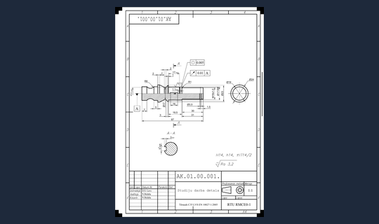

**M16×1.5 shaft characterization & production drawing**

Measured with Mitutoyo Contracer, Surftest, Roundtest plus micrometer (10 readings × 3 critical Ø). Produced ISO-compliant drawing with H7/k6 gear fit, DIN 6885 key, DIN 471 ring. Caught a 454→144.5 µm datum-mis-reference error.

`Mitutoyo` `GD&T` `ISO/DIN`

</td>
<td width="50%" valign="top">

### [🔌 04 · PLC Drilling Machine](04_Automated_Drilling_Machine_PLC/)

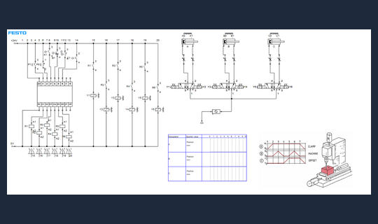

**Siemens LOGO! · GRAFCET · FluidSIM**

Automated two-hole drilling cell with 3 pneumatic cylinders + drill motor. Full implementation: GRAFCET sequence, FBD on LOGO!, AV.STOP relay system, Auto/Manual STEP modes, HANDS_OFF optical safety.

`Siemens LOGO!` `GRAFCET` `Safety systems`

</td>
</tr>
<tr>
<td width="50%" valign="top">

### [💡 05 · Industrial Electronics (7 labs)](05_Electronics_Coursework/)

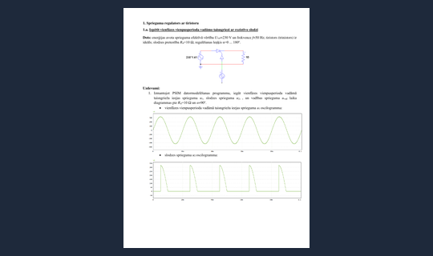

**Analog & power electronics with PSIM**

7 labs covering diodes (rectification, multiplication, stabilization), thyristor regulators, linear stabilizers, op-amps, ADC/DAC, sensors. Each combined analytical calculation, PSIM simulation and bench measurement.

`PSIM` `Power electronics` `Bench measurement`

</td>
<td width="50%" valign="top">

### [💻 07 · Programming (16 tasks)](07_Programming_Coursework/)

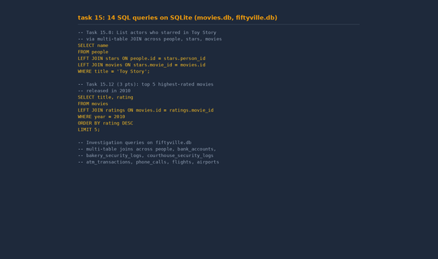

**Python → C → SQL → Flask**

16 progressive autograded tasks. Highlights: dynamic memory in C (valgrind-verified), 14 SQL queries on SQLite (movies + fiftyville investigation), Spotify-themed Flask web app with SQLite + Bootstrap.

`Python` `C/C++` `SQL` `Flask`

</td>
</tr>
<tr>
<td width="50%" valign="top">

### [🛠️ 09 · CNC Milling (G-code)](09_CNC_Milling_GCode/)

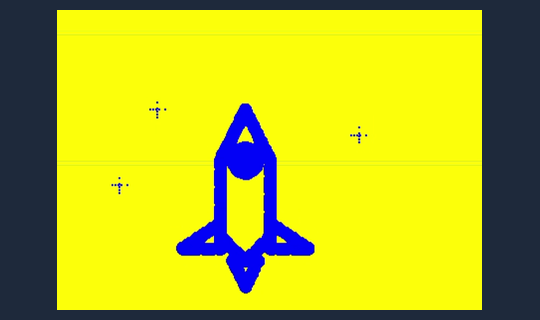

**Hand-written G-code in CNC Simulator Pro**

Wrote complete G-code program from scratch for HobbyMill — rocket-with-stars pattern on 150×100×20 mm stock with T6 flat end mill + T7 conical end mill. G01 contours + G02 arc + multi-tool sequencing.

`G-code` `CNC Simulator Pro` `Multi-tool`

</td>
<td width="50%" valign="top">

### [📊 08 · Belt Drive Calc (Jupyter)](08_Belt_Drive_Calculation_Jupyter/)

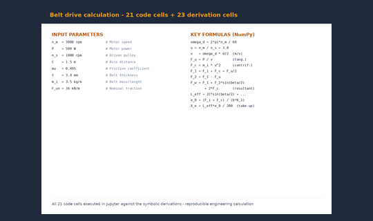

**Mechanical-element design as a reproducible notebook**

Habasit A3 flat belt drive sizing (3000 → 1000 rpm, 500 W, 1.5 m axis distance) implemented as a 45-cell Jupyter notebook — every LaTeX formula above the NumPy code that computes it.

`Jupyter` `NumPy` `LaTeX math`

</td>
</tr>
<tr>
<td width="50%" valign="top">

### [📏 06 · Engineering Drawings](06_Engineering_Drawing_Coursework/)

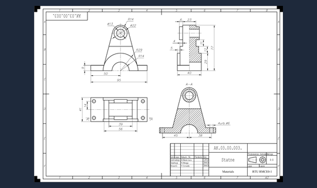

**A4/A3 technical drawings per ISO/LVS**

Four foundational drawings practicing multi-view projection, section views, dimensioning, surface roughness symbols and title-block discipline — the base for the later RTK and Metrology projects.

`AutoCAD` `ISO/LVS conventions`

</td>
<td width="50%" valign="top">

### [🦾 ROS 2 · SO-101 robot arm](https://github.com/Lavs-Daniels-Skots-231RMC173/so101-native-ubuntu-ros2-moveit)

**Real-hardware ROS 2 + MoveIt bring-up** *(separate repo)*

Physical SO-101 / SO-ARM101 leader–follower arm on native Ubuntu: 59 Hz teleop, a 2-camera **ACT** policy trained and pushed to Hugging Face, and a full `ros2_control` + **MoveIt** stack exercised on the real arm. An honest engineering log — the open problem is reconciling calibration across servo EEPROM → LeRobot → ROS 2 → URDF → MoveIt so the model and the physical robot agree (end-to-end pose alignment still in progress).

`ROS 2 Jazzy` `MoveIt` `ros2_control` `LeRobot` `real hardware`

</td>
</tr>
</table>

---

## 🏅 Certifications & training

## 🌍 Languages

| Language | Listening | Reading | Spoken | Writing |
|---|---|---|---|---|
| **Russian** 🇷🇺 | Native | Native | Native | Native |
| **Latvian** 🇱🇻 | C1 | C1 | B2 | C1 |
| **English** 🇬🇧 | B2 | C1 | B2 | C1 |

## 🎓 Education

| | |
|---|---|
| **2023 – 2027** *(expected)* | **B.Sc. Mechatronics** · Riga Technical University · GPA 9.21 / 10 · 4th year |
| **2010 – 2023** | Secondary education · Daugavpils Centra vidusskola · advanced courses in Physics & Robotics · school projects & olympiads |

---

## 📬 Get in touch

I'm open to **junior controls / automation / electronics engineer** roles and internships — based in Riga, Latvia, available for remote or hybrid work in the Baltic and EU region.

📞 +371 22 817 714 · 📍 Riga, Latvia

---

*This portfolio is licensed under [MIT](LICENSE) · feel free to use the README structure as a template for your own.*

